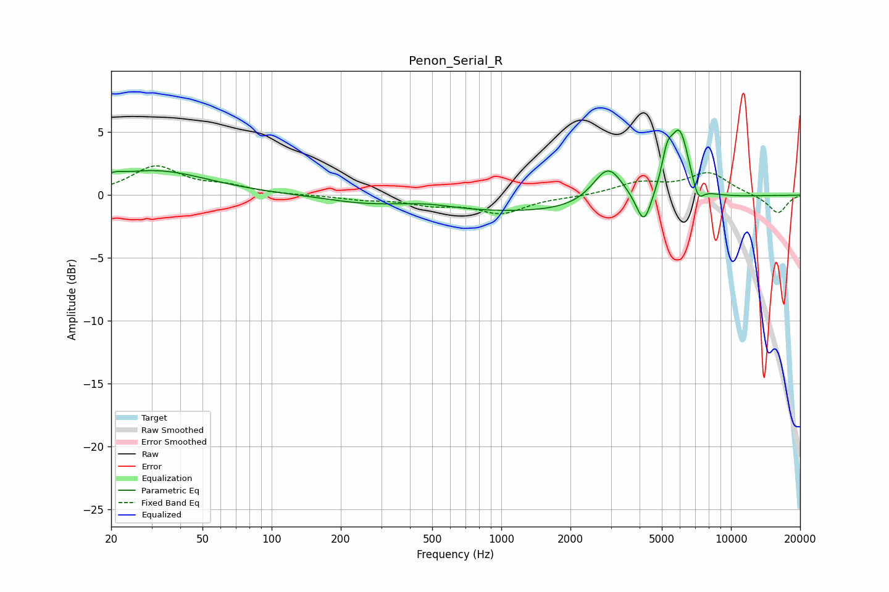

# Penon_Serial_R
See [usage instructions](https://github.com/jaakkopasanen/AutoEq#usage) for more options and info.

### Parametric EQs
Apply preamp of -5.3 dB when using parametric equalizer.

|   # | Type    |   Fc (Hz) |    Q |   Gain (dB) |
|-----|---------|-----------|------|-------------|
|   1 | Peaking |        21 | 4.32 |         0.3 |
|   2 | Peaking |        31 | 0.61 |         1.9 |
|   3 | Peaking |       242 | 0.98 |        -0.3 |
|   4 | Peaking |       475 | 1.14 |         0.4 |
|   5 | Peaking |      1405 | 0.23 |        -1.4 |
|   6 | Peaking |      2918 | 2.09 |         3.2 |
|   7 | Peaking |      4178 | 4.36 |        -2.6 |
|   8 | Peaking |      5267 | 5.99 |         2.1 |
|   9 | Peaking |      5976 | 3.1  |         5.5 |
|  10 | Peaking |      7171 | 5.23 |        -1.5 |

### Fixed Band EQs
When using fixed band (also called graphic) equalizer, apply preamp of **-2.4 dB** (if available) and set gains manually with these parameters.

|   # | Type    |   Fc (Hz) |    Q |   Gain (dB) |
|-----|---------|-----------|------|-------------|
|   1 | Peaking |        31 | 1.41 |         2.2 |
|   2 | Peaking |        62 | 1.41 |         0.6 |
|   3 | Peaking |       125 | 1.41 |        -0   |
|   4 | Peaking |       250 | 1.41 |        -0.3 |
|   5 | Peaking |       500 | 1.41 |        -0.7 |
|   6 | Peaking |      1000 | 1.41 |        -1.4 |
|   7 | Peaking |      2000 | 1.41 |        -0.1 |
|   8 | Peaking |      4000 | 1.41 |         0.9 |
|   9 | Peaking |      8000 | 1.41 |         1.7 |
|  10 | Peaking |     16000 | 1.41 |        -1.5 |

### Graphs

