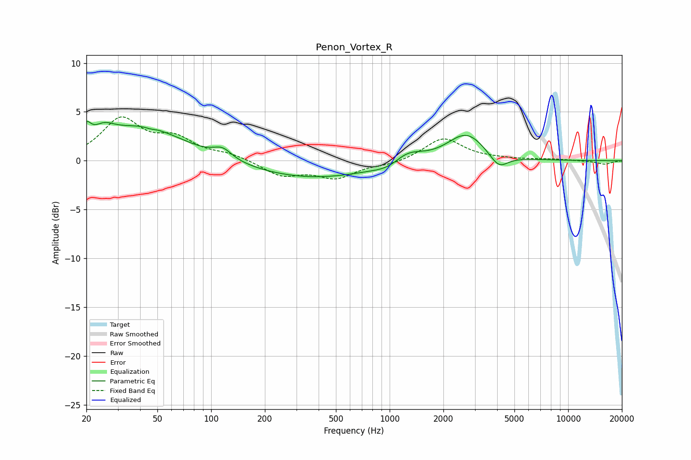

# Penon_Vortex_R
See [usage instructions](https://github.com/jaakkopasanen/AutoEq#usage) for more options and info.

### Parametric EQs
Apply preamp of -4.1 dB when using parametric equalizer.

|   # | Type    |   Fc (Hz) |    Q |   Gain (dB) |
|-----|---------|-----------|------|-------------|
|   1 | Peaking |        20 | 5.74 |         1.6 |
|   2 | Peaking |        25 | 2.34 |         1.3 |
|   3 | Peaking |        41 | 0.62 |         3.4 |
|   4 | Peaking |        45 | 5.62 |        -0.1 |
|   5 | Peaking |       116 | 2.73 |         1   |
|   6 | Peaking |       365 | 0.41 |        -1.8 |
|   7 | Peaking |       983 | 1.86 |        -0.6 |
|   8 | Peaking |      1259 | 1.69 |         1.2 |
|   9 | Peaking |      2690 | 1.33 |         2.9 |
|  10 | Peaking |      4082 | 2.71 |        -1.5 |

### Fixed Band EQs
When using fixed band (also called graphic) equalizer, apply preamp of **-4.6 dB** (if available) and set gains manually with these parameters.

|   # | Type    |   Fc (Hz) |    Q |   Gain (dB) |
|-----|---------|-----------|------|-------------|
|   1 | Peaking |        31 | 1.41 |         4.1 |
|   2 | Peaking |        62 | 1.41 |         2   |
|   3 | Peaking |       125 | 1.41 |         0.6 |
|   4 | Peaking |       250 | 1.41 |        -1.5 |
|   5 | Peaking |       500 | 1.41 |        -1.6 |
|   6 | Peaking |      1000 | 1.41 |        -0.4 |
|   7 | Peaking |      2000 | 1.41 |         2.3 |
|   8 | Peaking |      4000 | 1.41 |         0.1 |
|   9 | Peaking |      8000 | 1.41 |         0.1 |
|  10 | Peaking |     16000 | 1.41 |        -0.4 |

### Graphs

