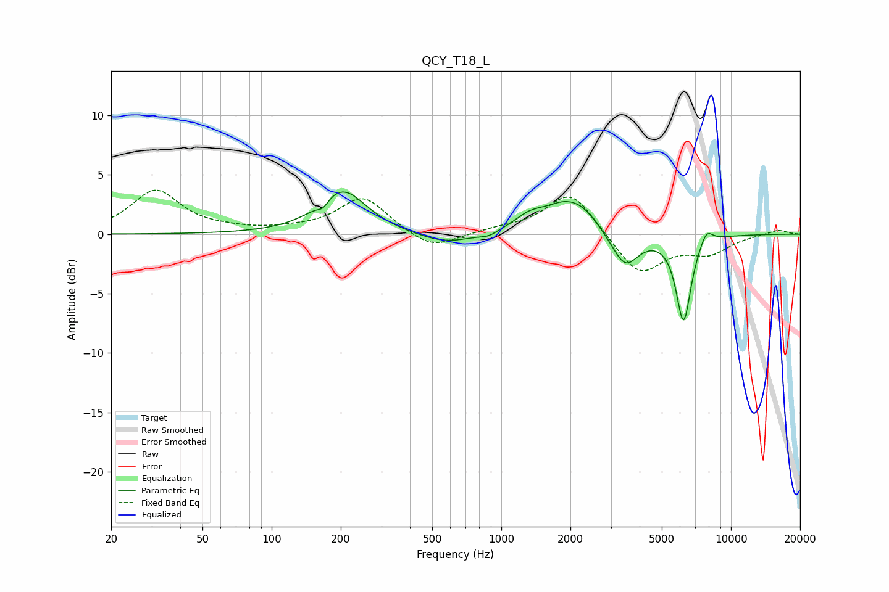

# QCY_T18_L
See [usage instructions](https://github.com/jaakkopasanen/AutoEq#usage) for more options and info.

### Parametric EQs
Apply preamp of -3.6 dB when using parametric equalizer.

|   # | Type    |   Fc (Hz) |    Q |   Gain (dB) |
|-----|---------|-----------|------|-------------|
|   1 | Peaking |       168 | 6    |        -0.6 |
|   2 | Peaking |       203 | 1.37 |         3.7 |
|   3 | Peaking |       576 | 1.16 |        -1   |
|   4 | Peaking |       881 | 3.67 |        -0.4 |
|   5 | Peaking |      1322 | 2.2  |         0.9 |
|   6 | Peaking |      1965 | 1.32 |         2.8 |
|   7 | Peaking |      2314 | 3.14 |         0.3 |
|   8 | Peaking |      3455 | 2.39 |        -3   |
|   9 | Peaking |      6217 | 4.21 |        -7.3 |
|  10 | Peaking |      7815 | 4.86 |         1.2 |

### Fixed Band EQs
When using fixed band (also called graphic) equalizer, apply preamp of **-3.8 dB** (if available) and set gains manually with these parameters.

|   # | Type    |   Fc (Hz) |    Q |   Gain (dB) |
|-----|---------|-----------|------|-------------|
|   1 | Peaking |        31 | 1.41 |         3.6 |
|   2 | Peaking |        62 | 1.41 |         0.2 |
|   3 | Peaking |       125 | 1.41 |         0.2 |
|   4 | Peaking |       250 | 1.41 |         3.1 |
|   5 | Peaking |       500 | 1.41 |        -1.4 |
|   6 | Peaking |      1000 | 1.41 |         0.3 |
|   7 | Peaking |      2000 | 1.41 |         3.7 |
|   8 | Peaking |      4000 | 1.41 |        -3.5 |
|   9 | Peaking |      8000 | 1.41 |        -1.5 |
|  10 | Peaking |     16000 | 1.41 |         0.4 |

### Graphs

