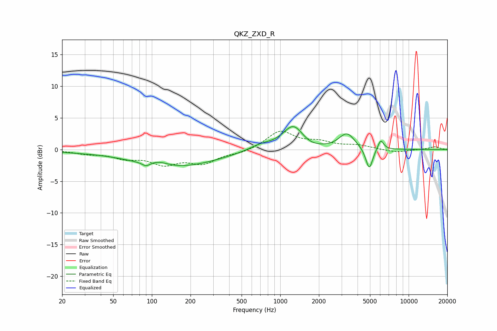

# QKZ_ZXD_R
See [usage instructions](https://github.com/jaakkopasanen/AutoEq#usage) for more options and info.

### Parametric EQs
Apply preamp of -3.7 dB when using parametric equalizer.

|   # | Type    |   Fc (Hz) |    Q |   Gain (dB) |
|-----|---------|-----------|------|-------------|
|   1 | Peaking |        25 | 0.9  |        -0.2 |
|   2 | Peaking |        90 | 4.53 |        -0.6 |
|   3 | Peaking |       113 | 1.94 |         0.7 |
|   4 | Peaking |       149 | 0.43 |        -2.8 |
|   5 | Peaking |       709 | 1.44 |         0.9 |
|   6 | Peaking |      1269 | 1.74 |         3.9 |
|   7 | Peaking |      1635 | 1.6  |        -0.6 |
|   8 | Peaking |      3307 | 2.31 |         2.5 |
|   9 | Peaking |      4931 | 5.09 |        -3.5 |
|  10 | Peaking |      6058 | 6    |         1.6 |

### Fixed Band EQs
When using fixed band (also called graphic) equalizer, apply preamp of **-3.0 dB** (if available) and set gains manually with these parameters.

|   # | Type    |   Fc (Hz) |    Q |   Gain (dB) |
|-----|---------|-----------|------|-------------|
|   1 | Peaking |        31 | 1.41 |        -0.5 |
|   2 | Peaking |        62 | 1.41 |        -1.2 |
|   3 | Peaking |       125 | 1.41 |        -2.1 |
|   4 | Peaking |       250 | 1.41 |        -2   |
|   5 | Peaking |       500 | 1.41 |        -0.5 |
|   6 | Peaking |      1000 | 1.41 |         2.9 |
|   7 | Peaking |      2000 | 1.41 |         1   |
|   8 | Peaking |      4000 | 1.41 |         0.6 |
|   9 | Peaking |      8000 | 1.41 |        -0.5 |
|  10 | Peaking |     16000 | 1.41 |         0.4 |

### Graphs

