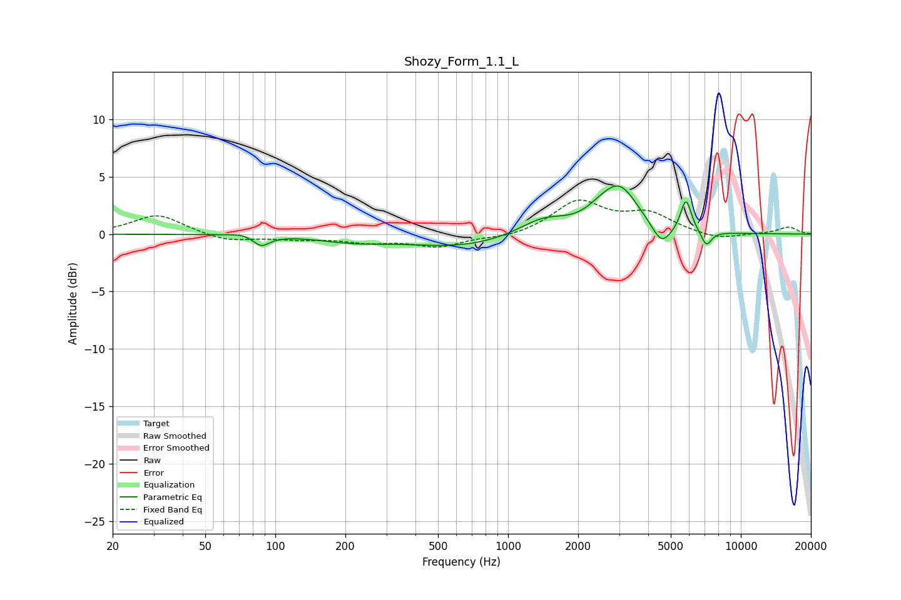

# Shozy_Form_1.1_L
See [usage instructions](https://github.com/jaakkopasanen/AutoEq#usage) for more options and info.

### Parametric EQs
Apply preamp of -4.3 dB when using parametric equalizer.

|   # | Type    |   Fc (Hz) |    Q |   Gain (dB) |
|-----|---------|-----------|------|-------------|
|   1 | Peaking |        74 | 2.57 |         0.3 |
|   2 | Peaking |        87 | 3.92 |        -1   |
|   3 | Peaking |       214 | 0.97 |        -0.5 |
|   4 | Peaking |       633 | 0.59 |        -1.1 |
|   5 | Peaking |      1413 | 1.31 |         1.5 |
|   6 | Peaking |      2430 | 2.61 |         0.5 |
|   7 | Peaking |      3000 | 1.72 |         4   |
|   8 | Peaking |      4567 | 3.36 |        -1.8 |
|   9 | Peaking |      5813 | 5.99 |         2.9 |
|  10 | Peaking |      7110 | 6    |        -1.3 |

### Fixed Band EQs
When using fixed band (also called graphic) equalizer, apply preamp of **-3.1 dB** (if available) and set gains manually with these parameters.

|   # | Type    |   Fc (Hz) |    Q |   Gain (dB) |
|-----|---------|-----------|------|-------------|
|   1 | Peaking |        31 | 1.41 |         1.7 |
|   2 | Peaking |        62 | 1.41 |        -0.6 |
|   3 | Peaking |       125 | 1.41 |        -0.4 |
|   4 | Peaking |       250 | 1.41 |        -0.6 |
|   5 | Peaking |       500 | 1.41 |        -1   |
|   6 | Peaking |      1000 | 1.41 |        -0.4 |
|   7 | Peaking |      2000 | 1.41 |         2.8 |
|   8 | Peaking |      4000 | 1.41 |         1.6 |
|   9 | Peaking |      8000 | 1.41 |        -0.5 |
|  10 | Peaking |     16000 | 1.41 |         0.6 |

### Graphs

