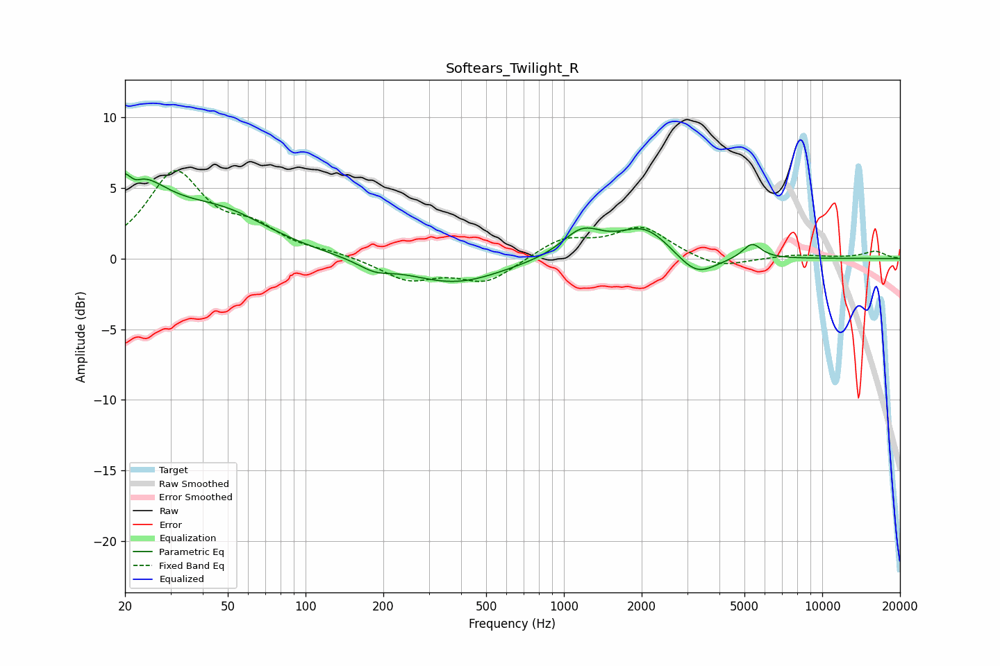

# Softears_Twilight_R
See [usage instructions](https://github.com/jaakkopasanen/AutoEq#usage) for more options and info.

### Parametric EQs
Apply preamp of -6.1 dB when using parametric equalizer.

|   # | Type    |   Fc (Hz) |    Q |   Gain (dB) |
|-----|---------|-----------|------|-------------|
|   1 | Peaking |        20 | 1.03 |         5.7 |
|   2 | Peaking |        22 | 5.69 |        -4   |
|   3 | Peaking |        22 | 5.94 |         3.2 |
|   4 | Peaking |        48 | 0.75 |         2.6 |
|   5 | Peaking |       185 | 2.26 |        -0.6 |
|   6 | Peaking |       377 | 0.77 |        -1.8 |
|   7 | Peaking |      1176 | 1.8  |         1.9 |
|   8 | Peaking |      2055 | 1.4  |         2.1 |
|   9 | Peaking |      3259 | 1.86 |        -1.6 |
|  10 | Peaking |      5347 | 3.84 |         1.1 |

### Fixed Band EQs
When using fixed band (also called graphic) equalizer, apply preamp of **-6.3 dB** (if available) and set gains manually with these parameters.

|   # | Type    |   Fc (Hz) |    Q |   Gain (dB) |
|-----|---------|-----------|------|-------------|
|   1 | Peaking |        31 | 1.41 |         5.9 |
|   2 | Peaking |        62 | 1.41 |         1.7 |
|   3 | Peaking |       125 | 1.41 |         0.3 |
|   4 | Peaking |       250 | 1.41 |        -1.5 |
|   5 | Peaking |       500 | 1.41 |        -1.7 |
|   6 | Peaking |      1000 | 1.41 |         1.4 |
|   7 | Peaking |      2000 | 1.41 |         2.1 |
|   8 | Peaking |      4000 | 1.41 |        -0.8 |
|   9 | Peaking |      8000 | 1.41 |         0.3 |
|  10 | Peaking |     16000 | 1.41 |         0.5 |

### Graphs

