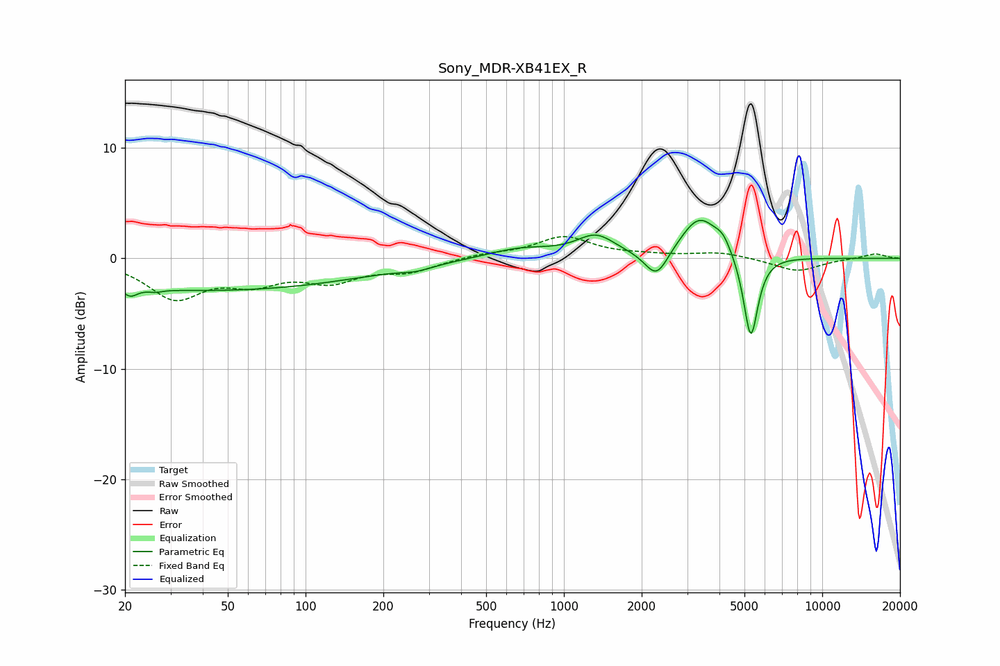

# Sony_MDR-XB41EX_R
See [usage instructions](https://github.com/jaakkopasanen/AutoEq#usage) for more options and info.

### Parametric EQs
Apply preamp of -3.5 dB when using parametric equalizer.

|   # | Type    |   Fc (Hz) |    Q |   Gain (dB) |
|-----|---------|-----------|------|-------------|
|   1 | Peaking |        21 | 5.24 |        -0.8 |
|   2 | Peaking |        26 | 5.51 |        -0.2 |
|   3 | Peaking |        43 | 0.23 |        -2.9 |
|   4 | Peaking |       268 | 2.41 |        -0.4 |
|   5 | Peaking |       678 | 1.06 |         0.9 |
|   6 | Peaking |      1330 | 1.9  |         1.9 |
|   7 | Peaking |      2284 | 3.13 |        -2.6 |
|   8 | Peaking |      3347 | 1.91 |         3.8 |
|   9 | Peaking |      4131 | 4.51 |         1   |
|  10 | Peaking |      5289 | 4.98 |        -7.8 |

### Fixed Band EQs
When using fixed band (also called graphic) equalizer, apply preamp of **-2.1 dB** (if available) and set gains manually with these parameters.

|   # | Type    |   Fc (Hz) |    Q |   Gain (dB) |
|-----|---------|-----------|------|-------------|
|   1 | Peaking |        31 | 1.41 |        -3.4 |
|   2 | Peaking |        62 | 1.41 |        -1.8 |
|   3 | Peaking |       125 | 1.41 |        -1.8 |
|   4 | Peaking |       250 | 1.41 |        -1.1 |
|   5 | Peaking |       500 | 1.41 |         0.4 |
|   6 | Peaking |      1000 | 1.41 |         1.9 |
|   7 | Peaking |      2000 | 1.41 |         0.2 |
|   8 | Peaking |      4000 | 1.41 |         0.5 |
|   9 | Peaking |      8000 | 1.41 |        -1.2 |
|  10 | Peaking |     16000 | 1.41 |         0.4 |

### Graphs

