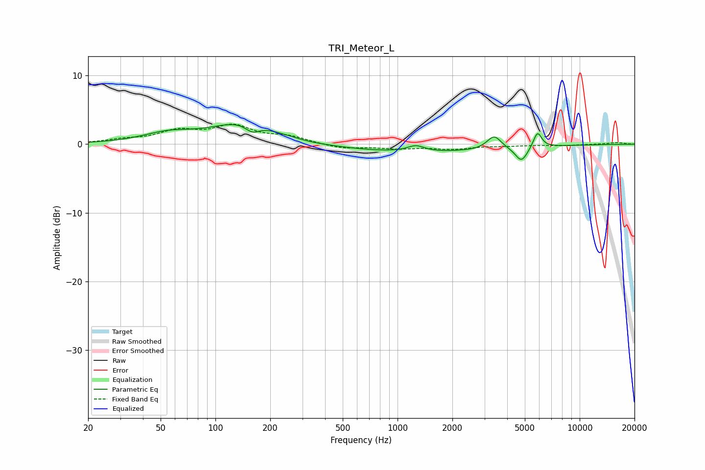

# TRI_Meteor_L
See [usage instructions](https://github.com/jaakkopasanen/AutoEq#usage) for more options and info.

### Parametric EQs
Apply preamp of -2.9 dB when using parametric equalizer.

|   # | Type    |   Fc (Hz) |    Q |   Gain (dB) |
|-----|---------|-----------|------|-------------|
|   1 | Peaking |        55 | 1.02 |         1.3 |
|   2 | Peaking |       145 | 0.8  |         3.2 |
|   3 | Peaking |       159 | 3.43 |        -1.3 |
|   4 | Peaking |       332 | 2.22 |        -0.1 |
|   5 | Peaking |      1261 | 2.97 |         0.9 |
|   6 | Peaking |      1379 | 0.3  |        -1.2 |
|   7 | Peaking |      2169 | 2.27 |         0   |
|   8 | Peaking |      3391 | 3.54 |         2   |
|   9 | Peaking |      4790 | 4.16 |        -2.1 |
|  10 | Peaking |      5869 | 6    |         2.4 |

### Fixed Band EQs
When using fixed band (also called graphic) equalizer, apply preamp of **-3.0 dB** (if available) and set gains manually with these parameters.

|   # | Type    |   Fc (Hz) |    Q |   Gain (dB) |
|-----|---------|-----------|------|-------------|
|   1 | Peaking |        31 | 1.41 |         0.5 |
|   2 | Peaking |        62 | 1.41 |         1.7 |
|   3 | Peaking |       125 | 1.41 |         2.4 |
|   4 | Peaking |       250 | 1.41 |         1   |
|   5 | Peaking |       500 | 1.41 |        -0.6 |
|   6 | Peaking |      1000 | 1.41 |        -0.5 |
|   7 | Peaking |      2000 | 1.41 |        -0.6 |
|   8 | Peaking |      4000 | 1.41 |        -0.2 |
|   9 | Peaking |      8000 | 1.41 |        -0.2 |
|  10 | Peaking |     16000 | 1.41 |         0.2 |

### Graphs

