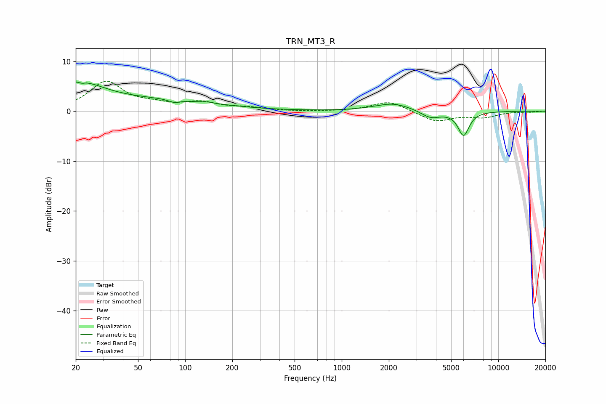

# TRN_MT3_R
See [usage instructions](https://github.com/jaakkopasanen/AutoEq#usage) for more options and info.

### Parametric EQs
Apply preamp of -6.0 dB when using parametric equalizer.

|   # | Type    |   Fc (Hz) |    Q |   Gain (dB) |
|-----|---------|-----------|------|-------------|
|   1 | Peaking |        20 | 0.85 |         4.4 |
|   2 | Peaking |        20 | 0.88 |         0.9 |
|   3 | Peaking |        23 | 5.71 |        -3.4 |
|   4 | Peaking |        23 | 6    |         3   |
|   5 | Peaking |        70 | 0.38 |         2   |
|   6 | Peaking |        85 | 3.86 |        -0.6 |
|   7 | Peaking |       141 | 4.34 |         0.2 |
|   8 | Peaking |      2129 | 1.2  |         1.6 |
|   9 | Peaking |      3696 | 2.22 |        -1.5 |
|  10 | Peaking |      6003 | 3.87 |        -4.8 |

### Fixed Band EQs
When using fixed band (also called graphic) equalizer, apply preamp of **-6.1 dB** (if available) and set gains manually with these parameters.

|   # | Type    |   Fc (Hz) |    Q |   Gain (dB) |
|-----|---------|-----------|------|-------------|
|   1 | Peaking |        31 | 1.41 |         5.8 |
|   2 | Peaking |        62 | 1.41 |         1   |
|   3 | Peaking |       125 | 1.41 |         1.6 |
|   4 | Peaking |       250 | 1.41 |         0.6 |
|   5 | Peaking |       500 | 1.41 |        -0.1 |
|   6 | Peaking |      1000 | 1.41 |        -0   |
|   7 | Peaking |      2000 | 1.41 |         2   |
|   8 | Peaking |      4000 | 1.41 |        -2.1 |
|   9 | Peaking |      8000 | 1.41 |        -1.1 |
|  10 | Peaking |     16000 | 1.41 |        -0.1 |

### Graphs

