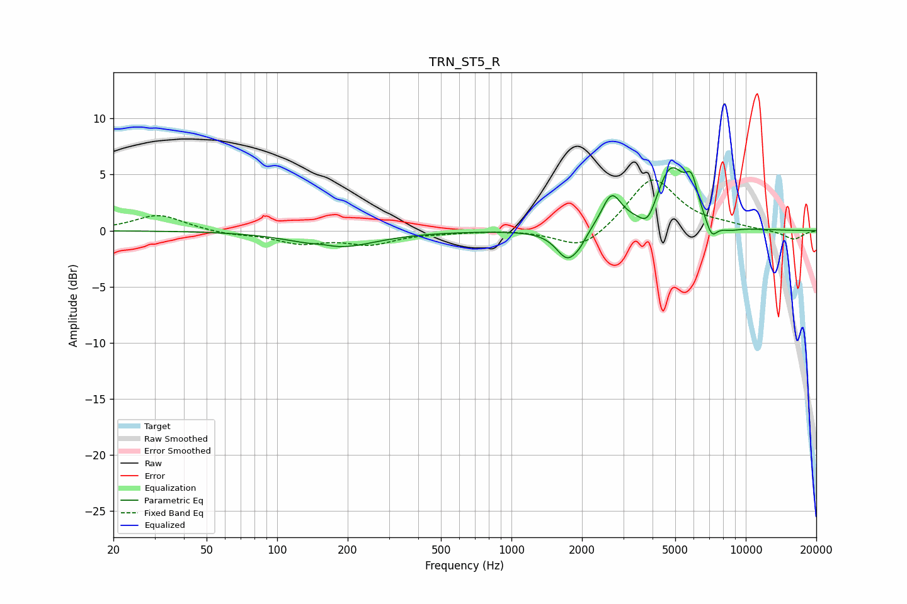

# TRN_ST5_R
See [usage instructions](https://github.com/jaakkopasanen/AutoEq#usage) for more options and info.

### Parametric EQs
Apply preamp of -5.7 dB when using parametric equalizer.

|   # | Type    |   Fc (Hz) |    Q |   Gain (dB) |
|-----|---------|-----------|------|-------------|
|   1 | Peaking |       157 | 2.94 |         0.2 |
|   2 | Peaking |       178 | 0.88 |        -1.5 |
|   3 | Peaking |      1735 | 2.94 |        -2.6 |
|   4 | Peaking |      1957 | 4.94 |        -0.5 |
|   5 | Peaking |      2674 | 3.37 |         3   |
|   6 | Peaking |      3827 | 3.88 |        -1.8 |
|   7 | Peaking |      4778 | 2.12 |         5.5 |
|   8 | Peaking |      5878 | 5.19 |         2.6 |
|   9 | Peaking |      7147 | 5.47 |        -1.6 |
|  10 | Peaking |      8443 | 2.8  |        -0.4 |

### Fixed Band EQs
When using fixed band (also called graphic) equalizer, apply preamp of **-4.6 dB** (if available) and set gains manually with these parameters.

|   # | Type    |   Fc (Hz) |    Q |   Gain (dB) |
|-----|---------|-----------|------|-------------|
|   1 | Peaking |        31 | 1.41 |         1.4 |
|   2 | Peaking |        62 | 1.41 |        -0.3 |
|   3 | Peaking |       125 | 1.41 |        -1   |
|   4 | Peaking |       250 | 1.41 |        -1.1 |
|   5 | Peaking |       500 | 1.41 |        -0.1 |
|   6 | Peaking |      1000 | 1.41 |         0.1 |
|   7 | Peaking |      2000 | 1.41 |        -1.9 |
|   8 | Peaking |      4000 | 1.41 |         4.8 |
|   9 | Peaking |      8000 | 1.41 |         0.3 |
|  10 | Peaking |     16000 | 1.41 |        -0.8 |

### Graphs

