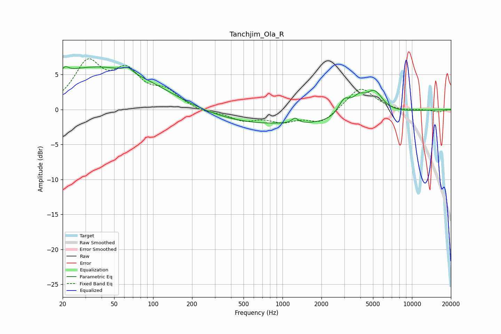

# Tanchjim_Ola_R
See [usage instructions](https://github.com/jaakkopasanen/AutoEq#usage) for more options and info.

### Parametric EQs
Apply preamp of -6.2 dB when using parametric equalizer.

|   # | Type    |   Fc (Hz) |    Q |   Gain (dB) |
|-----|---------|-----------|------|-------------|
|   1 | Peaking |        21 | 5.57 |         0.8 |
|   2 | Peaking |        37 | 0.29 |         6.1 |
|   3 | Peaking |        64 | 4.33 |         0.7 |
|   4 | Peaking |       976 | 1.32 |         0.1 |
|   5 | Peaking |      1083 | 0.2  |        -2.3 |
|   6 | Peaking |      1249 | 5.88 |         0.8 |
|   7 | Peaking |      2991 | 3.05 |         2.3 |
|   8 | Peaking |      3480 | 3.39 |         0.3 |
|   9 | Peaking |      3911 | 3.04 |         1.8 |
|  10 | Peaking |      5105 | 2.04 |         3.3 |

### Fixed Band EQs
When using fixed band (also called graphic) equalizer, apply preamp of **-7.4 dB** (if available) and set gains manually with these parameters.

|   # | Type    |   Fc (Hz) |    Q |   Gain (dB) |
|-----|---------|-----------|------|-------------|
|   1 | Peaking |        31 | 1.41 |         6.3 |
|   2 | Peaking |        62 | 1.41 |         4.7 |
|   3 | Peaking |       125 | 1.41 |         2.2 |
|   4 | Peaking |       250 | 1.41 |        -0.5 |
|   5 | Peaking |       500 | 1.41 |        -1.4 |
|   6 | Peaking |      1000 | 1.41 |        -1.5 |
|   7 | Peaking |      2000 | 1.41 |        -1.9 |
|   8 | Peaking |      4000 | 1.41 |         3.3 |
|   9 | Peaking |      8000 | 1.41 |        -0.2 |
|  10 | Peaking |     16000 | 1.41 |        -0.3 |

### Graphs

