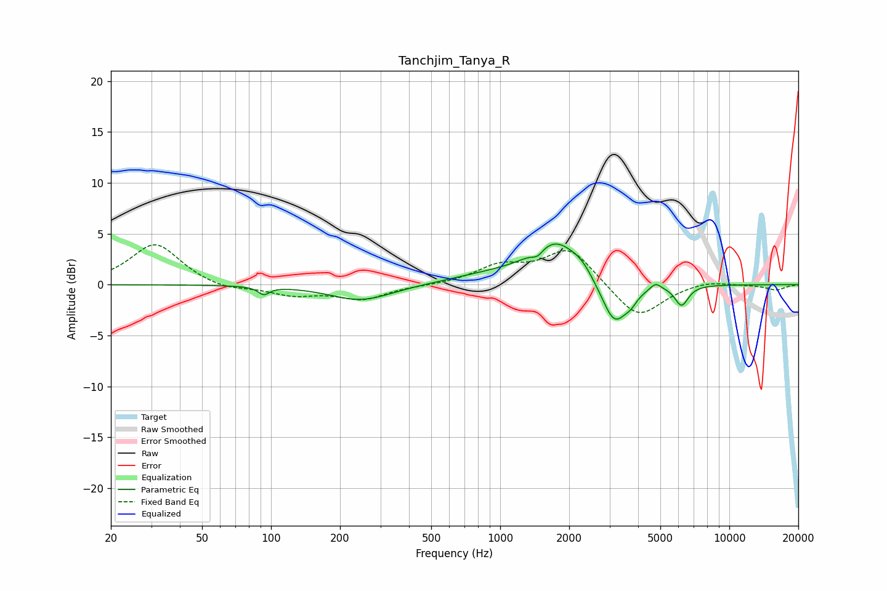

# Tanchjim_Tanya_R
See [usage instructions](https://github.com/jaakkopasanen/AutoEq#usage) for more options and info.

### Parametric EQs
Apply preamp of -4.1 dB when using parametric equalizer.

|   # | Type    |   Fc (Hz) |    Q |   Gain (dB) |
|-----|---------|-----------|------|-------------|
|   1 | Peaking |        93 | 5.89 |        -0.8 |
|   2 | Peaking |       248 | 1.03 |        -1.6 |
|   3 | Peaking |       914 | 0.74 |         0.8 |
|   4 | Peaking |      1457 | 5.76 |        -0.7 |
|   5 | Peaking |      1745 | 1.33 |         4   |
|   6 | Peaking |      2268 | 2.99 |         0.7 |
|   7 | Peaking |      3152 | 2.45 |        -4.4 |
|   8 | Peaking |      3720 | 5.36 |        -0.7 |
|   9 | Peaking |      4767 | 6    |         0.7 |
|  10 | Peaking |      6189 | 4.68 |        -2   |

### Fixed Band EQs
When using fixed band (also called graphic) equalizer, apply preamp of **-4.0 dB** (if available) and set gains manually with these parameters.

|   # | Type    |   Fc (Hz) |    Q |   Gain (dB) |
|-----|---------|-----------|------|-------------|
|   1 | Peaking |        31 | 1.41 |         4.1 |
|   2 | Peaking |        62 | 1.41 |        -0.6 |
|   3 | Peaking |       125 | 1.41 |        -1   |
|   4 | Peaking |       250 | 1.41 |        -1.4 |
|   5 | Peaking |       500 | 1.41 |        -0.1 |
|   6 | Peaking |      1000 | 1.41 |         1.7 |
|   7 | Peaking |      2000 | 1.41 |         3.6 |
|   8 | Peaking |      4000 | 1.41 |        -3.4 |
|   9 | Peaking |      8000 | 1.41 |         0.4 |
|  10 | Peaking |     16000 | 1.41 |        -0.5 |

### Graphs

