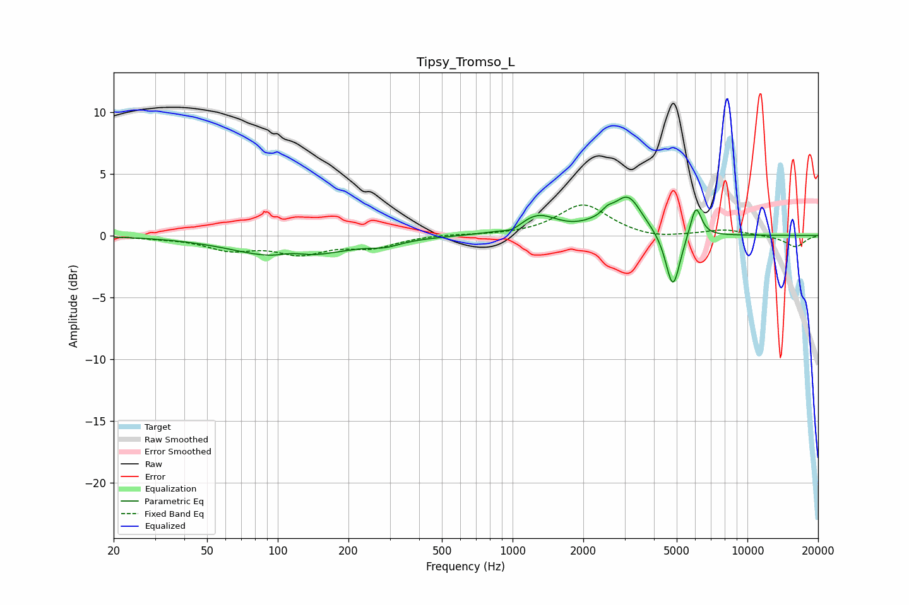

# Tipsy_Tromso_L
See [usage instructions](https://github.com/jaakkopasanen/AutoEq#usage) for more options and info.

### Parametric EQs
Apply preamp of -3.2 dB when using parametric equalizer.

|   # | Type    |   Fc (Hz) |    Q |   Gain (dB) |
|-----|---------|-----------|------|-------------|
|   1 | Peaking |       112 | 0.67 |        -2   |
|   2 | Peaking |       115 | 2.25 |         0.5 |
|   3 | Peaking |       287 | 2.21 |        -0.4 |
|   4 | Peaking |      1001 | 3.72 |        -0.4 |
|   5 | Peaking |      1277 | 1.69 |         1.6 |
|   6 | Peaking |      2168 | 2.45 |         0.3 |
|   7 | Peaking |      2533 | 5.47 |         0.6 |
|   8 | Peaking |      3096 | 2.33 |         3   |
|   9 | Peaking |      4817 | 4.57 |        -4.6 |
|  10 | Peaking |      6033 | 5.83 |         2.6 |

### Fixed Band EQs
When using fixed band (also called graphic) equalizer, apply preamp of **-2.6 dB** (if available) and set gains manually with these parameters.

|   # | Type    |   Fc (Hz) |    Q |   Gain (dB) |
|-----|---------|-----------|------|-------------|
|   1 | Peaking |        31 | 1.41 |        -0.1 |
|   2 | Peaking |        62 | 1.41 |        -1   |
|   3 | Peaking |       125 | 1.41 |        -1.3 |
|   4 | Peaking |       250 | 1.41 |        -0.9 |
|   5 | Peaking |       500 | 1.41 |         0.1 |
|   6 | Peaking |      1000 | 1.41 |        -0   |
|   7 | Peaking |      2000 | 1.41 |         2.5 |
|   8 | Peaking |      4000 | 1.41 |        -0.3 |
|   9 | Peaking |      8000 | 1.41 |         0.5 |
|  10 | Peaking |     16000 | 1.41 |        -0.9 |

### Graphs

