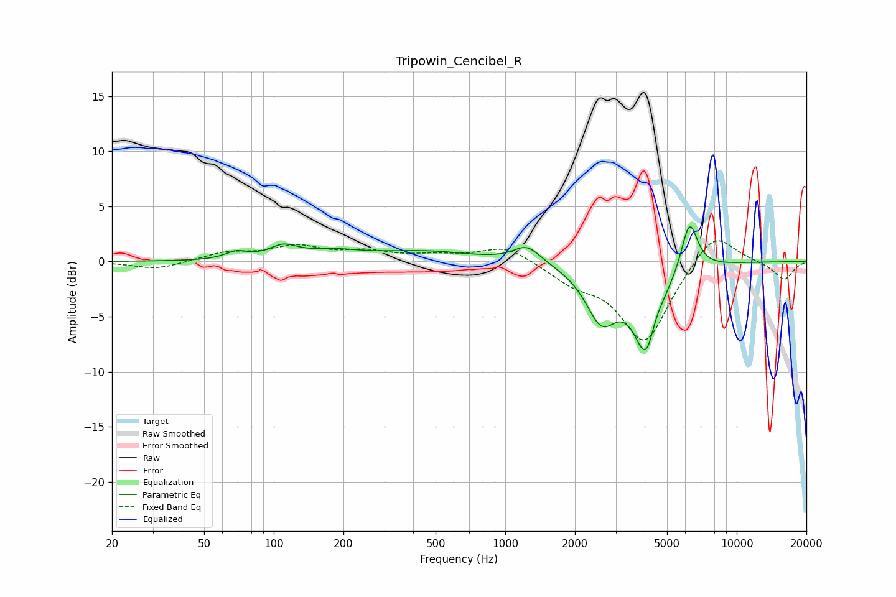

# Tripowin_Cencibel_R
See [usage instructions](https://github.com/jaakkopasanen/AutoEq#usage) for more options and info.

### Parametric EQs
Apply preamp of -3.2 dB when using parametric equalizer.

|   # | Type    |   Fc (Hz) |    Q |   Gain (dB) |
|-----|---------|-----------|------|-------------|
|   1 | Peaking |        69 | 3.13 |         0.7 |
|   2 | Peaking |       113 | 2.29 |         1.6 |
|   3 | Peaking |       118 | 2.59 |        -0.5 |
|   4 | Peaking |       182 | 1.16 |         0.7 |
|   5 | Peaking |       456 | 0.67 |         0.9 |
|   6 | Peaking |      1243 | 2.42 |         1.5 |
|   7 | Peaking |      2603 | 2.05 |        -4.8 |
|   8 | Peaking |      4116 | 2.51 |        -9   |
|   9 | Peaking |      4380 | 3.91 |         2.3 |
|  10 | Peaking |      6249 | 3.88 |         4.6 |

### Fixed Band EQs
When using fixed band (also called graphic) equalizer, apply preamp of **-2.0 dB** (if available) and set gains manually with these parameters.

|   # | Type    |   Fc (Hz) |    Q |   Gain (dB) |
|-----|---------|-----------|------|-------------|
|   1 | Peaking |        31 | 1.41 |        -0.7 |
|   2 | Peaking |        62 | 1.41 |         0.8 |
|   3 | Peaking |       125 | 1.41 |         1.3 |
|   4 | Peaking |       250 | 1.41 |         0.8 |
|   5 | Peaking |       500 | 1.41 |         0.5 |
|   6 | Peaking |      1000 | 1.41 |         1.5 |
|   7 | Peaking |      2000 | 1.41 |        -1.5 |
|   8 | Peaking |      4000 | 1.41 |        -7.3 |
|   9 | Peaking |      8000 | 1.41 |         3.1 |
|  10 | Peaking |     16000 | 1.41 |        -1.7 |

### Graphs

