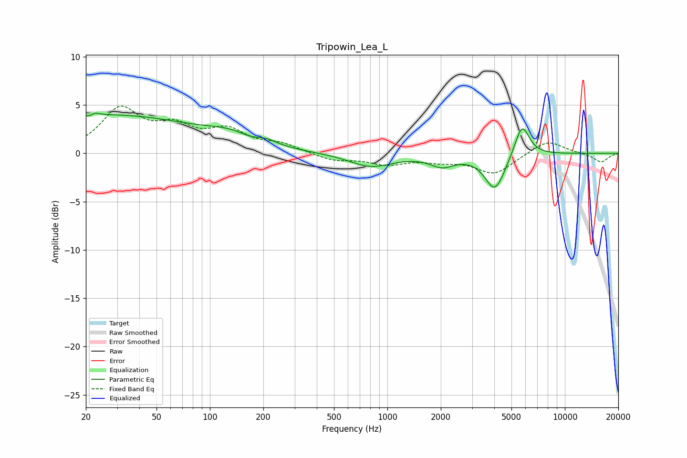

# Tripowin_Lea_L
See [usage instructions](https://github.com/jaakkopasanen/AutoEq#usage) for more options and info.

### Parametric EQs
Apply preamp of -4.2 dB when using parametric equalizer.

|   # | Type    |   Fc (Hz) |    Q |   Gain (dB) |
|-----|---------|-----------|------|-------------|
|   1 | Peaking |        21 | 6    |        -3.2 |
|   2 | Peaking |        22 | 5.7  |         3.3 |
|   3 | Peaking |        27 | 0.27 |         3.9 |
|   4 | Peaking |       136 | 0.99 |         1.1 |
|   5 | Peaking |       174 | 1.94 |        -0.5 |
|   6 | Peaking |       204 | 2.45 |         0.5 |
|   7 | Peaking |       808 | 1.16 |        -1.4 |
|   8 | Peaking |      2040 | 2.04 |        -1.1 |
|   9 | Peaking |      4037 | 2.46 |        -3.8 |
|  10 | Peaking |      5733 | 3.34 |         3.4 |

### Fixed Band EQs
When using fixed band (also called graphic) equalizer, apply preamp of **-5.0 dB** (if available) and set gains manually with these parameters.

|   # | Type    |   Fc (Hz) |    Q |   Gain (dB) |
|-----|---------|-----------|------|-------------|
|   1 | Peaking |        31 | 1.41 |         4.4 |
|   2 | Peaking |        62 | 1.41 |         2.3 |
|   3 | Peaking |       125 | 1.41 |         2.1 |
|   4 | Peaking |       250 | 1.41 |         0.8 |
|   5 | Peaking |       500 | 1.41 |        -0.7 |
|   6 | Peaking |      1000 | 1.41 |        -1   |
|   7 | Peaking |      2000 | 1.41 |        -0.6 |
|   8 | Peaking |      4000 | 1.41 |        -2.1 |
|   9 | Peaking |      8000 | 1.41 |         1.4 |
|  10 | Peaking |     16000 | 1.41 |        -0.9 |

### Graphs

