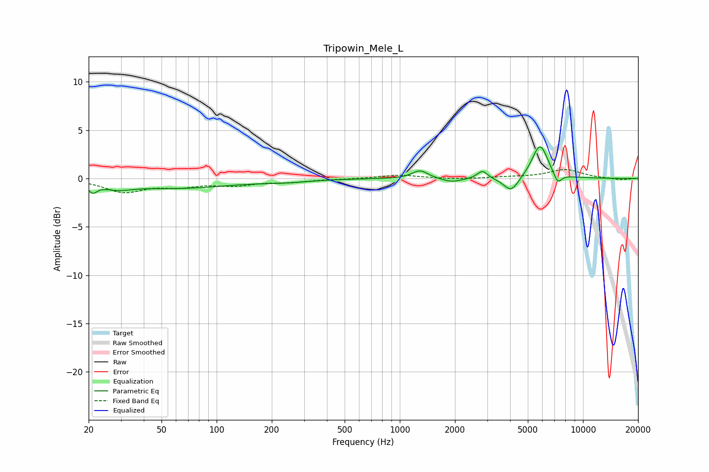

# Tripowin_Mele_L
See [usage instructions](https://github.com/jaakkopasanen/AutoEq#usage) for more options and info.

### Parametric EQs
Apply preamp of -3.4 dB when using parametric equalizer.

|   # | Type    |   Fc (Hz) |    Q |   Gain (dB) |
|-----|---------|-----------|------|-------------|
|   1 | Peaking |        21 | 5.9  |        -0.9 |
|   2 | Peaking |        29 | 1.75 |        -0.6 |
|   3 | Peaking |        62 | 0.49 |        -1   |
|   4 | Peaking |       237 | 1.05 |        -0.2 |
|   5 | Peaking |      1290 | 3.29 |         0.9 |
|   6 | Peaking |      1919 | 2.57 |        -0.4 |
|   7 | Peaking |      2826 | 5.12 |         0.9 |
|   8 | Peaking |      4057 | 3.42 |        -1.5 |
|   9 | Peaking |      5826 | 3.18 |         3.6 |
|  10 | Peaking |      7273 | 5.94 |        -1.1 |

### Fixed Band EQs
When using fixed band (also called graphic) equalizer, apply preamp of **-1.0 dB** (if available) and set gains manually with these parameters.

|   # | Type    |   Fc (Hz) |    Q |   Gain (dB) |
|-----|---------|-----------|------|-------------|
|   1 | Peaking |        31 | 1.41 |        -1.3 |
|   2 | Peaking |        62 | 1.41 |        -0.7 |
|   3 | Peaking |       125 | 1.41 |        -0.6 |
|   4 | Peaking |       250 | 1.41 |        -0.3 |
|   5 | Peaking |       500 | 1.41 |        -0   |
|   6 | Peaking |      1000 | 1.41 |         0.4 |
|   7 | Peaking |      2000 | 1.41 |        -0.1 |
|   8 | Peaking |      4000 | 1.41 |         0.1 |
|   9 | Peaking |      8000 | 1.41 |         0.9 |
|  10 | Peaking |     16000 | 1.41 |        -0.2 |

### Graphs

