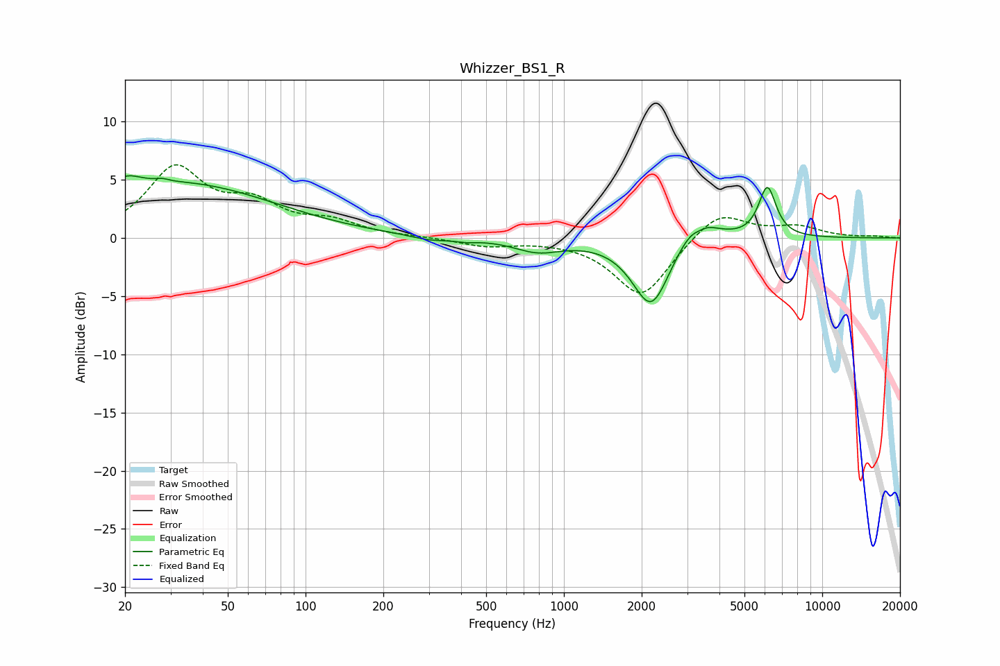

# Whizzer_BS1_R
See [usage instructions](https://github.com/jaakkopasanen/AutoEq#usage) for more options and info.

### Parametric EQs
Apply preamp of -5.4 dB when using parametric equalizer.

|   # | Type    |   Fc (Hz) |    Q |   Gain (dB) |
|-----|---------|-----------|------|-------------|
|   1 | Peaking |        20 | 2.27 |         1.3 |
|   2 | Peaking |        28 | 5.97 |         0.2 |
|   3 | Peaking |        33 | 0.39 |         4.6 |
|   4 | Peaking |       302 | 1.92 |        -0.4 |
|   5 | Peaking |       418 | 3.56 |        -0.2 |
|   6 | Peaking |       792 | 1.53 |        -1.1 |
|   7 | Peaking |      2180 | 1.94 |        -6.1 |
|   8 | Peaking |      3272 | 1.9  |         2.4 |
|   9 | Peaking |      3339 | 5.45 |        -0.4 |
|  10 | Peaking |      6131 | 4.08 |         4.3 |

### Fixed Band EQs
When using fixed band (also called graphic) equalizer, apply preamp of **-6.4 dB** (if available) and set gains manually with these parameters.

|   # | Type    |   Fc (Hz) |    Q |   Gain (dB) |
|-----|---------|-----------|------|-------------|
|   1 | Peaking |        31 | 1.41 |         5.8 |
|   2 | Peaking |        62 | 1.41 |         2.5 |
|   3 | Peaking |       125 | 1.41 |         1.2 |
|   4 | Peaking |       250 | 1.41 |         0.1 |
|   5 | Peaking |       500 | 1.41 |        -0.7 |
|   6 | Peaking |      1000 | 1.41 |        -0.1 |
|   7 | Peaking |      2000 | 1.41 |        -5.1 |
|   8 | Peaking |      4000 | 1.41 |         2.4 |
|   9 | Peaking |      8000 | 1.41 |         0.9 |
|  10 | Peaking |     16000 | 1.41 |         0.1 |

### Graphs

