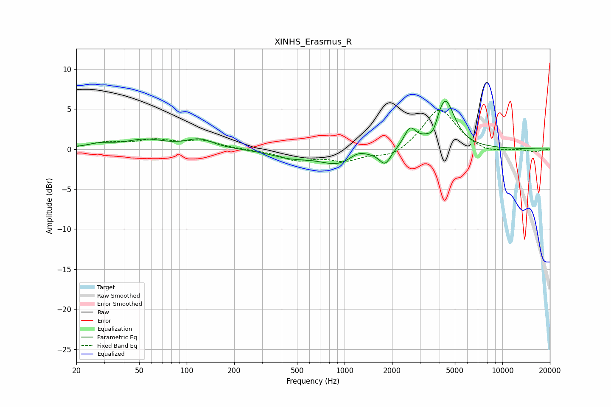

# XINHS_Erasmus_R
See [usage instructions](https://github.com/jaakkopasanen/AutoEq#usage) for more options and info.

### Parametric EQs
Apply preamp of -6.1 dB when using parametric equalizer.

|   # | Type    |   Fc (Hz) |    Q |   Gain (dB) |
|-----|---------|-----------|------|-------------|
|   1 | Peaking |        28 | 1.8  |         0.5 |
|   2 | Peaking |        55 | 1.13 |         1.1 |
|   3 | Peaking |       121 | 1.7  |         1.1 |
|   4 | Peaking |       454 | 1.13 |        -0.9 |
|   5 | Peaking |       915 | 1.16 |        -1.8 |
|   6 | Peaking |      1210 | 2.66 |         0.7 |
|   7 | Peaking |      1807 | 3.79 |        -1.9 |
|   8 | Peaking |      2598 | 3.82 |         2.3 |
|   9 | Peaking |      3640 | 4.92 |        -1.2 |
|  10 | Peaking |      4331 | 2.35 |         6.2 |

### Fixed Band EQs
When using fixed band (also called graphic) equalizer, apply preamp of **-5.0 dB** (if available) and set gains manually with these parameters.

|   # | Type    |   Fc (Hz) |    Q |   Gain (dB) |
|-----|---------|-----------|------|-------------|
|   1 | Peaking |        31 | 1.41 |         0.7 |
|   2 | Peaking |        62 | 1.41 |         1   |
|   3 | Peaking |       125 | 1.41 |         1   |
|   4 | Peaking |       250 | 1.41 |        -0.1 |
|   5 | Peaking |       500 | 1.41 |        -1.3 |
|   6 | Peaking |      1000 | 1.41 |        -1.3 |
|   7 | Peaking |      2000 | 1.41 |        -1.1 |
|   8 | Peaking |      4000 | 1.41 |         5.2 |
|   9 | Peaking |      8000 | 1.41 |        -0.6 |
|  10 | Peaking |     16000 | 1.41 |        -0.4 |

### Graphs

