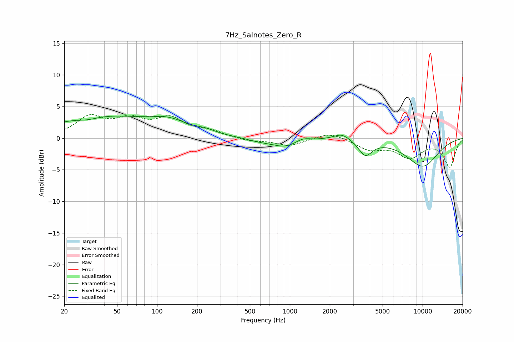

# 7Hz_Salnotes_Zero_R
See [usage instructions](https://github.com/jaakkopasanen/AutoEq#usage) for more options and info.

### Parametric EQs
Apply preamp of -3.6 dB when using parametric equalizer.

|   # | Type    |   Fc (Hz) |    Q |   Gain (dB) |
|-----|---------|-----------|------|-------------|
|   1 | Peaking |        30 | 1.94 |        -0.4 |
|   2 | Peaking |        40 | 0.35 |         3.4 |
|   3 | Peaking |       125 | 1.11 |         1.5 |
|   4 | Peaking |       232 | 1.9  |         0.5 |
|   5 | Peaking |       582 | 1.62 |        -0.4 |
|   6 | Peaking |       919 | 1.4  |        -1.4 |
|   7 | Peaking |      1249 | 2.63 |         0.6 |
|   8 | Peaking |      2474 | 2.29 |         1.1 |
|   9 | Peaking |      3703 | 2.79 |        -2.4 |
|  10 | Peaking |     10000 | 0.98 |        -4.4 |

### Fixed Band EQs
When using fixed band (also called graphic) equalizer, apply preamp of **-3.8 dB** (if available) and set gains manually with these parameters.

|   # | Type    |   Fc (Hz) |    Q |   Gain (dB) |
|-----|---------|-----------|------|-------------|
|   1 | Peaking |        31 | 1.41 |         3.1 |
|   2 | Peaking |        62 | 1.41 |         2.5 |
|   3 | Peaking |       125 | 1.41 |         2.8 |
|   4 | Peaking |       250 | 1.41 |         1   |
|   5 | Peaking |       500 | 1.41 |        -0.5 |
|   6 | Peaking |      1000 | 1.41 |        -1.2 |
|   7 | Peaking |      2000 | 1.41 |         1   |
|   8 | Peaking |      4000 | 1.41 |        -1.7 |
|   9 | Peaking |      8000 | 1.41 |        -2.8 |
|  10 | Peaking |     16000 | 1.41 |        -4.5 |

### Graphs

