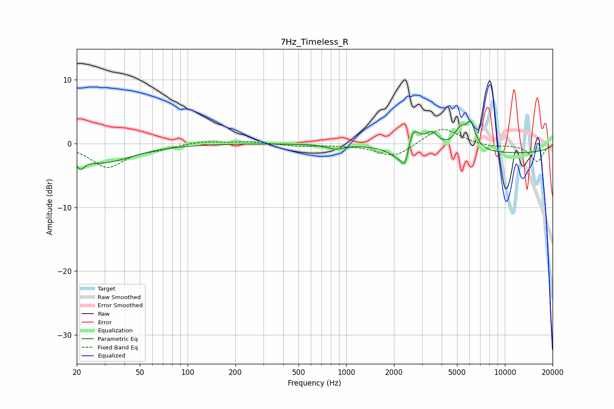

# 7Hz_Timeless_R
See [usage instructions](https://github.com/jaakkopasanen/AutoEq#usage) for more options and info.

### Parametric EQs
Apply preamp of -3.6 dB when using parametric equalizer.

|   # | Type    |   Fc (Hz) |    Q |   Gain (dB) |
|-----|---------|-----------|------|-------------|
|   1 | Peaking |        21 | 5.36 |        -1.7 |
|   2 | Peaking |        29 | 0.75 |        -2.9 |
|   3 | Peaking |       848 | 2.72 |        -0.7 |
|   4 | Peaking |      2097 | 2.39 |        -1.5 |
|   5 | Peaking |      2358 | 5.31 |        -3.8 |
|   6 | Peaking |      2613 | 3.58 |         4.1 |
|   7 | Peaking |      3461 | 3.36 |         2.3 |
|   8 | Peaking |      5234 | 3.66 |         2.9 |
|   9 | Peaking |      6108 | 4.64 |         3.7 |
|  10 | Peaking |      9590 | 0.22 |        -1.6 |

### Fixed Band EQs
When using fixed band (also called graphic) equalizer, apply preamp of **-2.3 dB** (if available) and set gains manually with these parameters.

|   # | Type    |   Fc (Hz) |    Q |   Gain (dB) |
|-----|---------|-----------|------|-------------|
|   1 | Peaking |        31 | 1.41 |        -3.6 |
|   2 | Peaking |        62 | 1.41 |        -0.7 |
|   3 | Peaking |       125 | 1.41 |         0.4 |
|   4 | Peaking |       250 | 1.41 |         0.3 |
|   5 | Peaking |       500 | 1.41 |        -0.4 |
|   6 | Peaking |      1000 | 1.41 |        -0.2 |
|   7 | Peaking |      2000 | 1.41 |        -2.2 |
|   8 | Peaking |      4000 | 1.41 |         2.7 |
|   9 | Peaking |      8000 | 1.41 |        -0.5 |
|  10 | Peaking |     16000 | 1.41 |        -2.8 |

### Graphs

