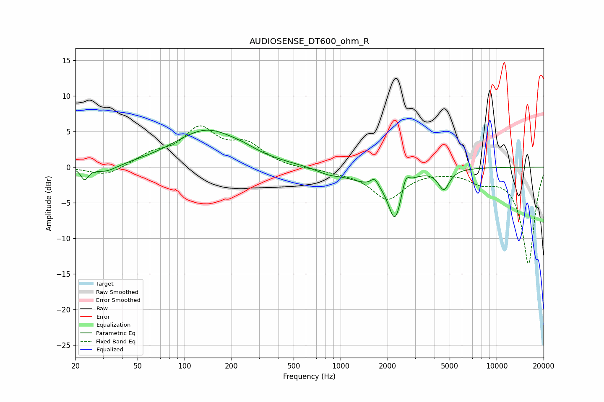

# AUDIOSENSE_DT600_ohm_R
See [usage instructions](https://github.com/jaakkopasanen/AutoEq#usage) for more options and info.

### Parametric EQs
Apply preamp of -5.3 dB when using parametric equalizer.

|   # | Type    |   Fc (Hz) |    Q |   Gain (dB) |
|-----|---------|-----------|------|-------------|
|   1 | Peaking |        23 | 6    |        -1.7 |
|   2 | Peaking |        31 | 1.9  |        -1   |
|   3 | Peaking |       139 | 0.67 |         5.2 |
|   4 | Peaking |       237 | 1.77 |         0.4 |
|   5 | Peaking |       835 | 1.81 |        -0.7 |
|   6 | Peaking |      1444 | 1.13 |        -1.7 |
|   7 | Peaking |      1652 | 6    |         1.1 |
|   8 | Peaking |      2235 | 3.22 |        -6.6 |
|   9 | Peaking |      2606 | 6    |         2.1 |
|  10 | Peaking |      4588 | 3.98 |        -2.8 |

### Fixed Band EQs
When using fixed band (also called graphic) equalizer, apply preamp of **-5.9 dB** (if available) and set gains manually with these parameters.

|   # | Type    |   Fc (Hz) |    Q |   Gain (dB) |
|-----|---------|-----------|------|-------------|
|   1 | Peaking |        31 | 1.41 |        -1.3 |
|   2 | Peaking |        62 | 1.41 |         1.6 |
|   3 | Peaking |       125 | 1.41 |         5.1 |
|   4 | Peaking |       250 | 1.41 |         2.8 |
|   5 | Peaking |       500 | 1.41 |        -0.2 |
|   6 | Peaking |      1000 | 1.41 |        -0.5 |
|   7 | Peaking |      2000 | 1.41 |        -4.4 |
|   8 | Peaking |      4000 | 1.41 |        -0.2 |
|   9 | Peaking |      8000 | 1.41 |        -1.6 |
|  10 | Peaking |     16000 | 1.41 |       -13.6 |

### Graphs

