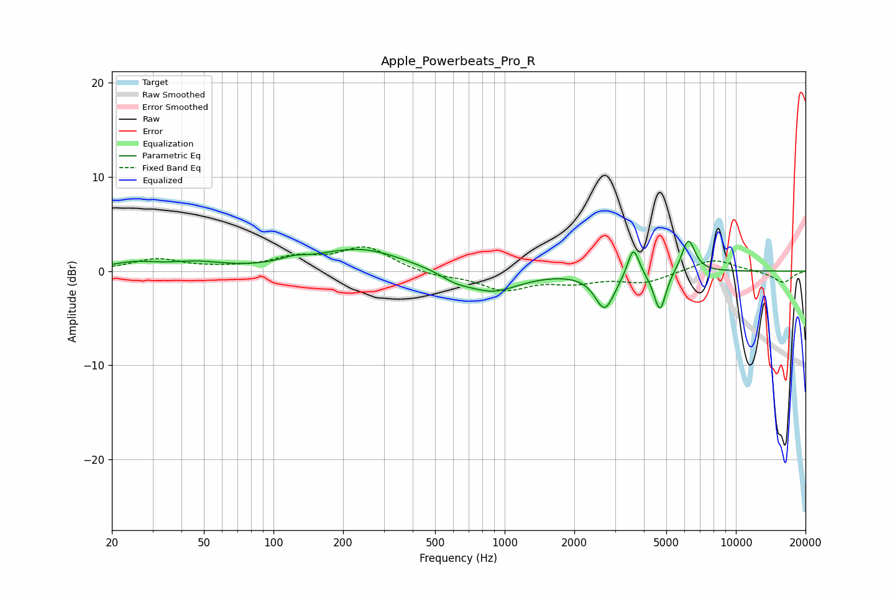

# Apple_Powerbeats_Pro_R
See [usage instructions](https://github.com/jaakkopasanen/AutoEq#usage) for more options and info.

### Parametric EQs
Apply preamp of -3.3 dB when using parametric equalizer.

|   # | Type    |   Fc (Hz) |    Q |   Gain (dB) |
|-----|---------|-----------|------|-------------|
|   1 | Peaking |        25 | 1.38 |         0.8 |
|   2 | Peaking |        46 | 1.24 |         0.7 |
|   3 | Peaking |       122 | 2.58 |         0.5 |
|   4 | Peaking |       237 | 0.75 |         2.4 |
|   5 | Peaking |       610 | 2.17 |        -0.7 |
|   6 | Peaking |       881 | 1.2  |        -2.2 |
|   7 | Peaking |      2709 | 3.34 |        -3.9 |
|   8 | Peaking |      3601 | 5.74 |         3.2 |
|   9 | Peaking |      4692 | 5.42 |        -4.3 |
|  10 | Peaking |      6228 | 4.77 |         3.6 |

### Fixed Band EQs
When using fixed band (also called graphic) equalizer, apply preamp of **-2.7 dB** (if available) and set gains manually with these parameters.

|   # | Type    |   Fc (Hz) |    Q |   Gain (dB) |
|-----|---------|-----------|------|-------------|
|   1 | Peaking |        31 | 1.41 |         1.2 |
|   2 | Peaking |        62 | 1.41 |         0.2 |
|   3 | Peaking |       125 | 1.41 |         1.3 |
|   4 | Peaking |       250 | 1.41 |         2.5 |
|   5 | Peaking |       500 | 1.41 |        -0.5 |
|   6 | Peaking |      1000 | 1.41 |        -1.9 |
|   7 | Peaking |      2000 | 1.41 |        -1   |
|   8 | Peaking |      4000 | 1.41 |        -1.2 |
|   9 | Peaking |      8000 | 1.41 |         1.3 |
|  10 | Peaking |     16000 | 1.41 |        -1.2 |

### Graphs

