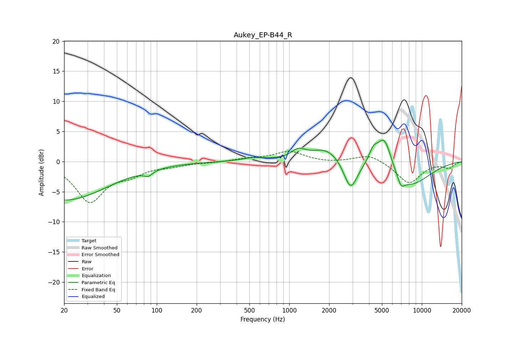

# Aukey_EP-B44_R
See [usage instructions](https://github.com/jaakkopasanen/AutoEq#usage) for more options and info.

### Parametric EQs
Apply preamp of -3.6 dB when using parametric equalizer.

|   # | Type    |   Fc (Hz) |    Q |   Gain (dB) |
|-----|---------|-----------|------|-------------|
|   1 | Peaking |        20 | 0.43 |        -6.4 |
|   2 | Peaking |        86 | 4.37 |        -0.8 |
|   3 | Peaking |       535 | 1.53 |         0.5 |
|   4 | Peaking |      1171 | 2.8  |         1.3 |
|   5 | Peaking |      1941 | 1.12 |         2.5 |
|   6 | Peaking |      2897 | 2.66 |        -5.2 |
|   7 | Peaking |      4311 | 4.08 |         2.1 |
|   8 | Peaking |      5218 | 2.48 |         5.7 |
|   9 | Peaking |      6972 | 5.07 |        -1.6 |
|  10 | Peaking |      7885 | 0.81 |        -4.2 |

### Fixed Band EQs
When using fixed band (also called graphic) equalizer, apply preamp of **-1.8 dB** (if available) and set gains manually with these parameters.

|   # | Type    |   Fc (Hz) |    Q |   Gain (dB) |
|-----|---------|-----------|------|-------------|
|   1 | Peaking |        31 | 1.41 |        -6.5 |
|   2 | Peaking |        62 | 1.41 |        -1.7 |
|   3 | Peaking |       125 | 1.41 |        -0.6 |
|   4 | Peaking |       250 | 1.41 |        -0.1 |
|   5 | Peaking |       500 | 1.41 |         0.5 |
|   6 | Peaking |      1000 | 1.41 |         1.6 |
|   7 | Peaking |      2000 | 1.41 |        -0.2 |
|   8 | Peaking |      4000 | 1.41 |         1.3 |
|   9 | Peaking |      8000 | 1.41 |        -3.6 |
|  10 | Peaking |     16000 | 1.41 |        -1   |

### Graphs

