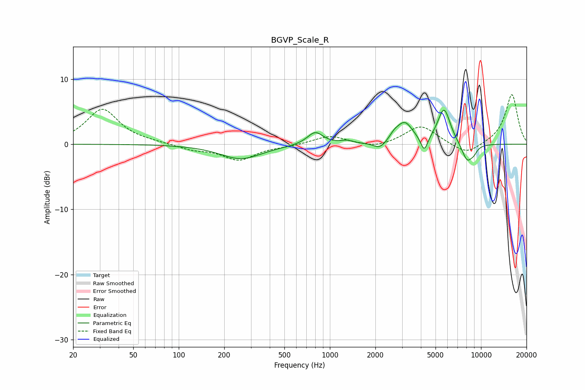

# BGVP_Scale_R
See [usage instructions](https://github.com/jaakkopasanen/AutoEq#usage) for more options and info.

### Parametric EQs
Apply preamp of -5.3 dB when using parametric equalizer.

|   # | Type    |   Fc (Hz) |    Q |   Gain (dB) |
|-----|---------|-----------|------|-------------|
|   1 | Peaking |       258 | 1.02 |        -2.2 |
|   2 | Peaking |       799 | 2.73 |         2   |
|   3 | Peaking |      1294 | 3.81 |         0.4 |
|   4 | Peaking |      2143 | 3.38 |        -1.1 |
|   5 | Peaking |      2665 | 4.77 |         0.7 |
|   6 | Peaking |      3121 | 2.62 |         3.2 |
|   7 | Peaking |      4213 | 5.95 |        -2.4 |
|   8 | Peaking |      5692 | 3.25 |         5.4 |
|   9 | Peaking |      8108 | 3.53 |        -2.9 |
|  10 | Peaking |      8976 | 6    |        -0.7 |

### Fixed Band EQs
When using fixed band (also called graphic) equalizer, apply preamp of **-7.7 dB** (if available) and set gains manually with these parameters.

|   # | Type    |   Fc (Hz) |    Q |   Gain (dB) |
|-----|---------|-----------|------|-------------|
|   1 | Peaking |        31 | 1.41 |         5.4 |
|   2 | Peaking |        62 | 1.41 |         0.2 |
|   3 | Peaking |       125 | 1.41 |        -0.8 |
|   4 | Peaking |       250 | 1.41 |        -2.4 |
|   5 | Peaking |       500 | 1.41 |        -0.3 |
|   6 | Peaking |      1000 | 1.41 |         1.3 |
|   7 | Peaking |      2000 | 1.41 |        -0.7 |
|   8 | Peaking |      4000 | 1.41 |         2.9 |
|   9 | Peaking |      8000 | 1.41 |        -1.8 |
|  10 | Peaking |     16000 | 1.41 |         7.7 |

### Graphs

