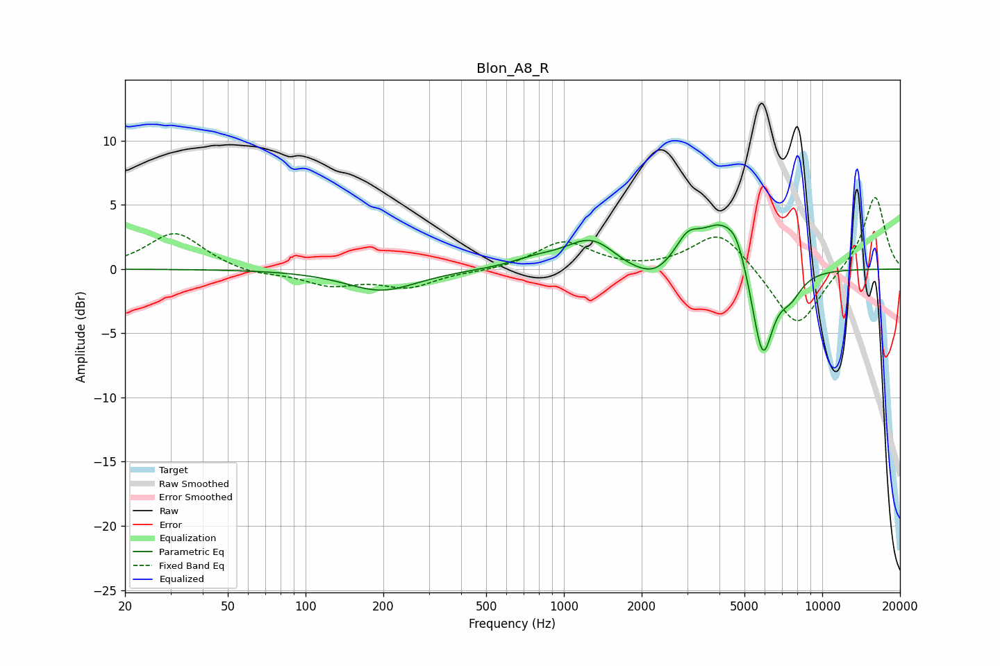

# Blon_A8_R
See [usage instructions](https://github.com/jaakkopasanen/AutoEq#usage) for more options and info.

### Parametric EQs
Apply preamp of -3.5 dB when using parametric equalizer.

|   # | Type    |   Fc (Hz) |    Q |   Gain (dB) |
|-----|---------|-----------|------|-------------|
|   1 | Peaking |       197 | 1.02 |        -1.7 |
|   2 | Peaking |       765 | 1.62 |         0.5 |
|   3 | Peaking |      1283 | 1.36 |         2.4 |
|   4 | Peaking |      1756 | 1.78 |        -0.6 |
|   5 | Peaking |      2249 | 1.97 |        -1.2 |
|   6 | Peaking |      3010 | 2.95 |         1.8 |
|   7 | Peaking |      4057 | 1.67 |         3.5 |
|   8 | Peaking |      4659 | 3.87 |         1.4 |
|   9 | Peaking |      5876 | 3.27 |        -7.4 |
|  10 | Peaking |      7525 | 2.88 |        -1.6 |

### Fixed Band EQs
When using fixed band (also called graphic) equalizer, apply preamp of **-5.7 dB** (if available) and set gains manually with these parameters.

|   # | Type    |   Fc (Hz) |    Q |   Gain (dB) |
|-----|---------|-----------|------|-------------|
|   1 | Peaking |        31 | 1.41 |         2.9 |
|   2 | Peaking |        62 | 1.41 |        -0.4 |
|   3 | Peaking |       125 | 1.41 |        -1.2 |
|   4 | Peaking |       250 | 1.41 |        -1.3 |
|   5 | Peaking |       500 | 1.41 |        -0.1 |
|   6 | Peaking |      1000 | 1.41 |         2.1 |
|   7 | Peaking |      2000 | 1.41 |        -0.1 |
|   8 | Peaking |      4000 | 1.41 |         3.1 |
|   9 | Peaking |      8000 | 1.41 |        -4.8 |
|  10 | Peaking |     16000 | 1.41 |         5.8 |

### Graphs

