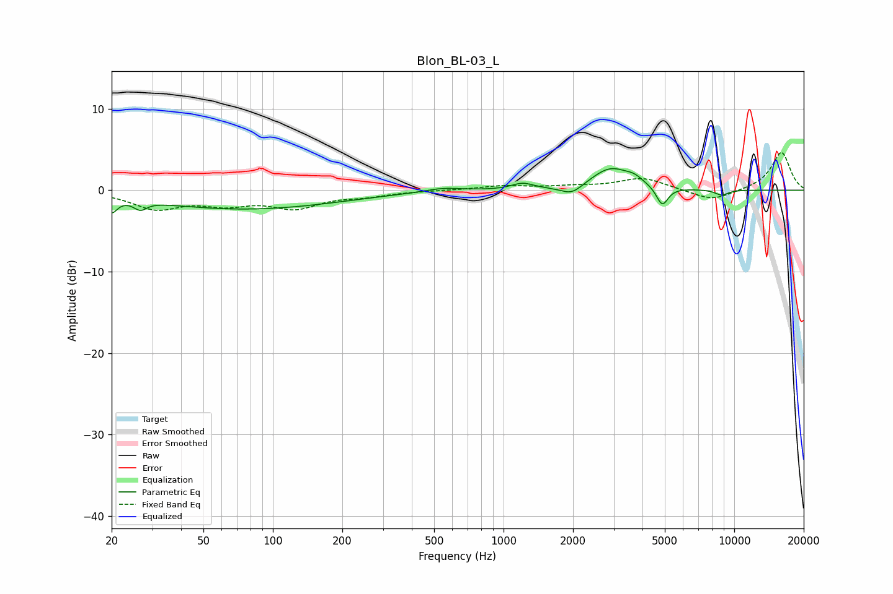

# Blon_BL-03_L
See [usage instructions](https://github.com/jaakkopasanen/AutoEq#usage) for more options and info.

### Parametric EQs
Apply preamp of -2.8 dB when using parametric equalizer.

|   # | Type    |   Fc (Hz) |    Q |   Gain (dB) |
|-----|---------|-----------|------|-------------|
|   1 | Peaking |        20 | 5.97 |        -1.8 |
|   2 | Peaking |        27 | 5.22 |        -1   |
|   3 | Peaking |        76 | 0.35 |        -2.3 |
|   4 | Peaking |       546 | 1.75 |         0.5 |
|   5 | Peaking |      1210 | 3    |         0.8 |
|   6 | Peaking |      1975 | 2.96 |        -1.2 |
|   7 | Peaking |      2915 | 1.64 |         2.7 |
|   8 | Peaking |      3699 | 3.83 |         0.6 |
|   9 | Peaking |      4874 | 5.54 |        -2.3 |
|  10 | Peaking |      8824 | 4.45 |        -0.7 |

### Fixed Band EQs
When using fixed band (also called graphic) equalizer, apply preamp of **-4.7 dB** (if available) and set gains manually with these parameters.

|   # | Type    |   Fc (Hz) |    Q |   Gain (dB) |
|-----|---------|-----------|------|-------------|
|   1 | Peaking |        31 | 1.41 |        -2.1 |
|   2 | Peaking |        62 | 1.41 |        -1.4 |
|   3 | Peaking |       125 | 1.41 |        -2   |
|   4 | Peaking |       250 | 1.41 |        -0.6 |
|   5 | Peaking |       500 | 1.41 |        -0   |
|   6 | Peaking |      1000 | 1.41 |         0.5 |
|   7 | Peaking |      2000 | 1.41 |         0.4 |
|   8 | Peaking |      4000 | 1.41 |         1.5 |
|   9 | Peaking |      8000 | 1.41 |        -1.4 |
|  10 | Peaking |     16000 | 1.41 |         4.7 |

### Graphs

