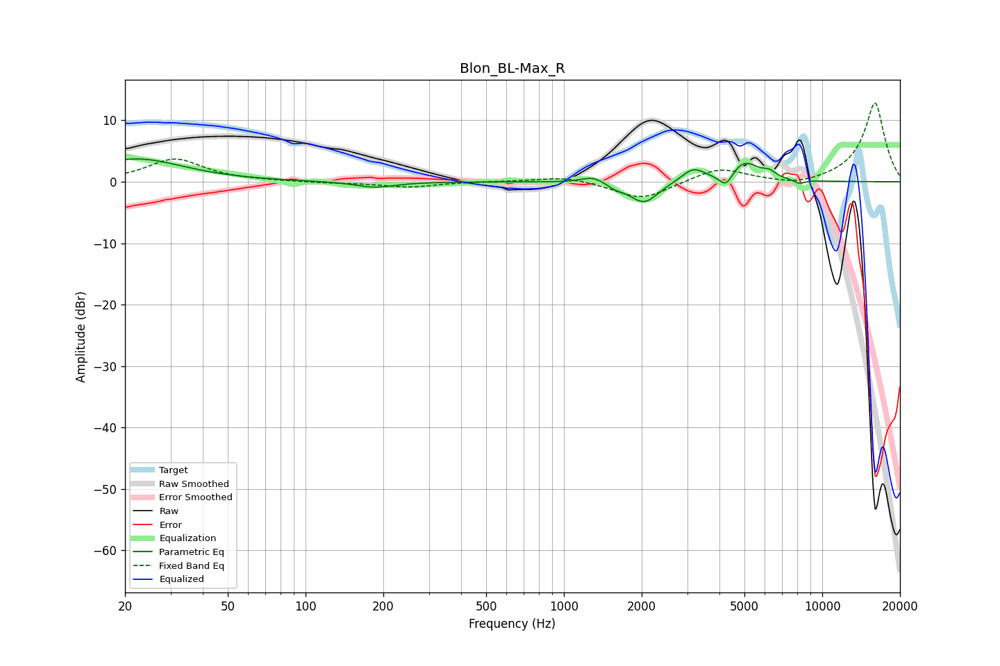

# Blon_BL-Max_R
See [usage instructions](https://github.com/jaakkopasanen/AutoEq#usage) for more options and info.

### Parametric EQs
Apply preamp of -3.8 dB when using parametric equalizer.

|   # | Type    |   Fc (Hz) |    Q |   Gain (dB) |
|-----|---------|-----------|------|-------------|
|   1 | Peaking |        22 | 0.8  |         3.7 |
|   2 | Peaking |       186 | 1.83 |        -1   |
|   3 | Peaking |      1294 | 3.18 |         1.1 |
|   4 | Peaking |      1584 | 4.48 |        -0.6 |
|   5 | Peaking |      2042 | 2.55 |        -3.6 |
|   6 | Peaking |      3165 | 3.15 |         2.2 |
|   7 | Peaking |      4246 | 5.07 |        -2.5 |
|   8 | Peaking |      4967 | 2.36 |         3.4 |
|   9 | Peaking |      6234 | 5.93 |         0.8 |
|  10 | Peaking |      8151 | 6    |        -0.6 |

### Fixed Band EQs
When using fixed band (also called graphic) equalizer, apply preamp of **-12.9 dB** (if available) and set gains manually with these parameters.

|   # | Type    |   Fc (Hz) |    Q |   Gain (dB) |
|-----|---------|-----------|------|-------------|
|   1 | Peaking |        31 | 1.41 |         3.7 |
|   2 | Peaking |        62 | 1.41 |         0.1 |
|   3 | Peaking |       125 | 1.41 |        -0.2 |
|   4 | Peaking |       250 | 1.41 |        -0.9 |
|   5 | Peaking |       500 | 1.41 |         0.1 |
|   6 | Peaking |      1000 | 1.41 |         0.9 |
|   7 | Peaking |      2000 | 1.41 |        -3   |
|   8 | Peaking |      4000 | 1.41 |         2.3 |
|   9 | Peaking |      8000 | 1.41 |        -0.8 |
|  10 | Peaking |     16000 | 1.41 |        12.9 |

### Graphs

