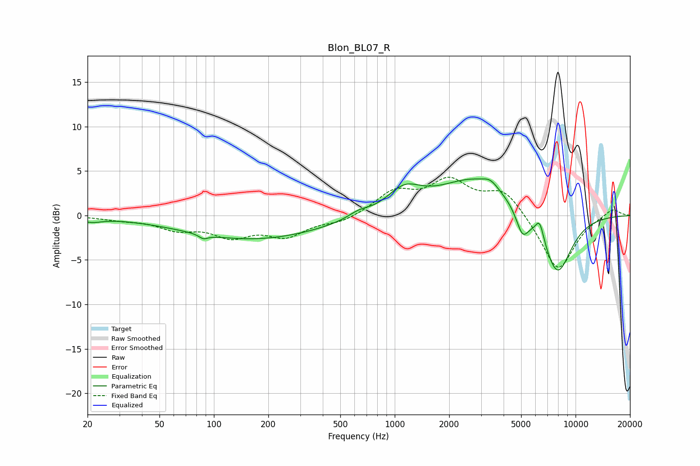

# Blon_BL07_R
See [usage instructions](https://github.com/jaakkopasanen/AutoEq#usage) for more options and info.

### Parametric EQs
Apply preamp of -4.2 dB when using parametric equalizer.

|   # | Type    |   Fc (Hz) |    Q |   Gain (dB) |
|-----|---------|-----------|------|-------------|
|   1 | Peaking |        21 | 2.54 |        -0.5 |
|   2 | Peaking |        88 | 5.74 |        -0.5 |
|   3 | Peaking |       165 | 0.37 |        -2.7 |
|   4 | Peaking |       631 | 2.46 |         0.6 |
|   5 | Peaking |      1126 | 1.5  |         2.5 |
|   6 | Peaking |      2793 | 0.69 |         4.1 |
|   7 | Peaking |      3382 | 3.45 |         0.8 |
|   8 | Peaking |      5086 | 3.95 |        -2.7 |
|   9 | Peaking |      6335 | 6    |         2   |
|  10 | Peaking |      7918 | 1.64 |        -7   |

### Fixed Band EQs
When using fixed band (also called graphic) equalizer, apply preamp of **-4.4 dB** (if available) and set gains manually with these parameters.

|   # | Type    |   Fc (Hz) |    Q |   Gain (dB) |
|-----|---------|-----------|------|-------------|
|   1 | Peaking |        31 | 1.41 |        -0.4 |
|   2 | Peaking |        62 | 1.41 |        -1.4 |
|   3 | Peaking |       125 | 1.41 |        -2.1 |
|   4 | Peaking |       250 | 1.41 |        -2.1 |
|   5 | Peaking |       500 | 1.41 |        -0.8 |
|   6 | Peaking |      1000 | 1.41 |         2.5 |
|   7 | Peaking |      2000 | 1.41 |         3.6 |
|   8 | Peaking |      4000 | 1.41 |         2.8 |
|   9 | Peaking |      8000 | 1.41 |        -6.4 |
|  10 | Peaking |     16000 | 1.41 |         0.9 |

### Graphs

