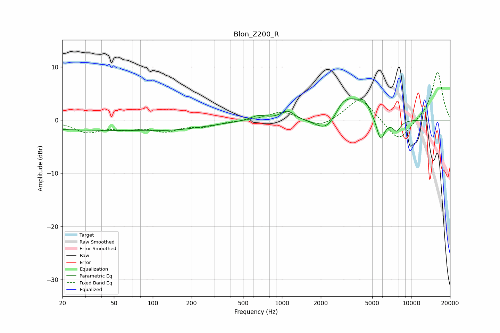

# Blon_Z200_R
See [usage instructions](https://github.com/jaakkopasanen/AutoEq#usage) for more options and info.

### Parametric EQs
Apply preamp of -4.1 dB when using parametric equalizer.

|   # | Type    |   Fc (Hz) |    Q |   Gain (dB) |
|-----|---------|-----------|------|-------------|
|   1 | Peaking |        33 | 0.18 |        -1.8 |
|   2 | Peaking |       169 | 0.57 |        -0.8 |
|   3 | Peaking |       658 | 2.25 |         1   |
|   4 | Peaking |      1104 | 2.65 |         1.7 |
|   5 | Peaking |      2199 | 1.73 |        -2.8 |
|   6 | Peaking |      2879 | 3.52 |         0.8 |
|   7 | Peaking |      3309 | 1.52 |         4.1 |
|   8 | Peaking |      4349 | 3.22 |         2.2 |
|   9 | Peaking |      5811 | 4.39 |        -4.3 |
|  10 | Peaking |      7723 | 4.16 |        -2   |

### Fixed Band EQs
When using fixed band (also called graphic) equalizer, apply preamp of **-9.1 dB** (if available) and set gains manually with these parameters.

|   # | Type    |   Fc (Hz) |    Q |   Gain (dB) |
|-----|---------|-----------|------|-------------|
|   1 | Peaking |        31 | 1.41 |        -2.1 |
|   2 | Peaking |        62 | 1.41 |        -1.2 |
|   3 | Peaking |       125 | 1.41 |        -1.8 |
|   4 | Peaking |       250 | 1.41 |        -1   |
|   5 | Peaking |       500 | 1.41 |        -0.1 |
|   6 | Peaking |      1000 | 1.41 |         1.7 |
|   7 | Peaking |      2000 | 1.41 |        -1.6 |
|   8 | Peaking |      4000 | 1.41 |         4.4 |
|   9 | Peaking |      8000 | 1.41 |        -4.3 |
|  10 | Peaking |     16000 | 1.41 |         9.2 |

### Graphs

