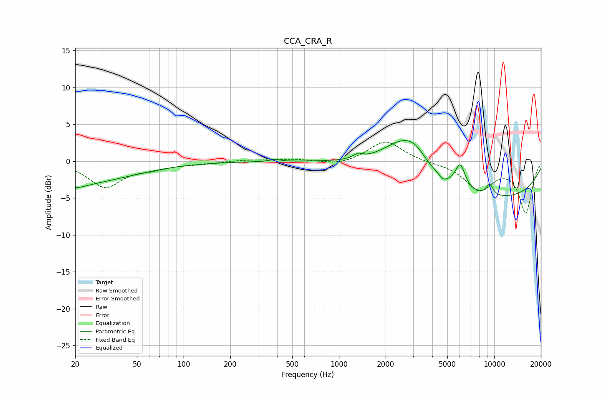

# CCA_CRA_R
See [usage instructions](https://github.com/jaakkopasanen/AutoEq#usage) for more options and info.

### Parametric EQs
Apply preamp of -2.9 dB when using parametric equalizer.

|   # | Type    |   Fc (Hz) |    Q |   Gain (dB) |
|-----|---------|-----------|------|-------------|
|   1 | Peaking |        20 | 1.99 |        -0.8 |
|   2 | Peaking |        22 | 0.42 |        -2.8 |
|   3 | Peaking |       388 | 5.26 |         0.3 |
|   4 | Peaking |      1321 | 4.87 |         0.6 |
|   5 | Peaking |      2581 | 1.04 |         4.2 |
|   6 | Peaking |      3089 | 2.03 |         1.4 |
|   7 | Peaking |      4717 | 5.37 |        -0.6 |
|   8 | Peaking |      6045 | 4.29 |         3.2 |
|   9 | Peaking |      9352 | 5.38 |         1.5 |
|  10 | Peaking |      9697 | 0.25 |        -5.1 |

### Fixed Band EQs
When using fixed band (also called graphic) equalizer, apply preamp of **-2.7 dB** (if available) and set gains manually with these parameters.

|   # | Type    |   Fc (Hz) |    Q |   Gain (dB) |
|-----|---------|-----------|------|-------------|
|   1 | Peaking |        31 | 1.41 |        -3.4 |
|   2 | Peaking |        62 | 1.41 |        -0.8 |
|   3 | Peaking |       125 | 1.41 |        -0.3 |
|   4 | Peaking |       250 | 1.41 |         0.2 |
|   5 | Peaking |       500 | 1.41 |         0.3 |
|   6 | Peaking |      1000 | 1.41 |        -0.6 |
|   7 | Peaking |      2000 | 1.41 |         2.8 |
|   8 | Peaking |      4000 | 1.41 |        -0.1 |
|   9 | Peaking |      8000 | 1.41 |        -3.7 |
|  10 | Peaking |     16000 | 1.41 |        -6.9 |

### Graphs

