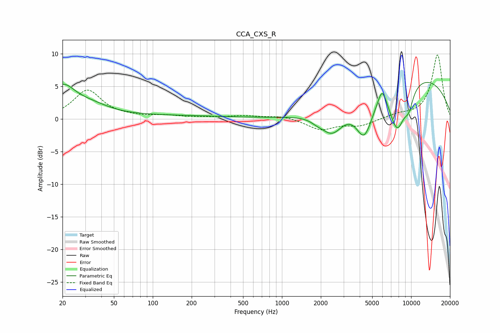

# CCA_CXS_R
See [usage instructions](https://github.com/jaakkopasanen/AutoEq#usage) for more options and info.

### Parametric EQs
Apply preamp of -5.7 dB when using parametric equalizer.

|   # | Type    |   Fc (Hz) |    Q |   Gain (dB) |
|-----|---------|-----------|------|-------------|
|   1 | Peaking |        20 | 1.43 |         4.5 |
|   2 | Peaking |        33 | 0.99 |         1.4 |
|   3 | Peaking |       126 | 0.29 |         0.5 |
|   4 | Peaking |      1867 | 3.14 |        -0.4 |
|   5 | Peaking |      2445 | 1.6  |        -3.8 |
|   6 | Peaking |      4339 | 2.13 |        -5.9 |
|   7 | Peaking |      5965 | 4.21 |         2.8 |
|   8 | Peaking |      7808 | 2.08 |        -7   |
|   9 | Peaking |      9591 | 3.51 |        -2.6 |
|  10 | Peaking |     10000 | 0.27 |         6.9 |

### Fixed Band EQs
When using fixed band (also called graphic) equalizer, apply preamp of **-9.9 dB** (if available) and set gains manually with these parameters.

|   # | Type    |   Fc (Hz) |    Q |   Gain (dB) |
|-----|---------|-----------|------|-------------|
|   1 | Peaking |        31 | 1.41 |         4.4 |
|   2 | Peaking |        62 | 1.41 |         0.2 |
|   3 | Peaking |       125 | 1.41 |         0.4 |
|   4 | Peaking |       250 | 1.41 |         0.2 |
|   5 | Peaking |       500 | 1.41 |         0.4 |
|   6 | Peaking |      1000 | 1.41 |         0.5 |
|   7 | Peaking |      2000 | 1.41 |        -1.6 |
|   8 | Peaking |      4000 | 1.41 |        -1   |
|   9 | Peaking |      8000 | 1.41 |         0.6 |
|  10 | Peaking |     16000 | 1.41 |         9.8 |

### Graphs

