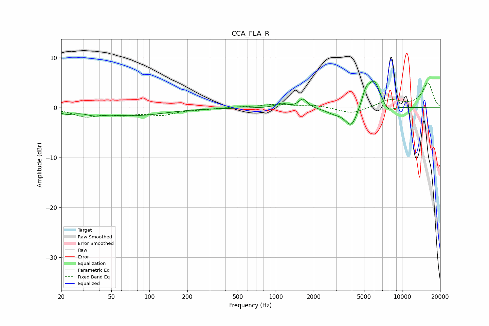

# CCA_FLA_R
See [usage instructions](https://github.com/jaakkopasanen/AutoEq#usage) for more options and info.

### Parametric EQs
Apply preamp of -5.4 dB when using parametric equalizer.

|   # | Type    |   Fc (Hz) |    Q |   Gain (dB) |
|-----|---------|-----------|------|-------------|
|   1 | Peaking |        22 | 2.41 |        -0.9 |
|   2 | Peaking |        37 | 2.03 |        -0.8 |
|   3 | Peaking |        77 | 0.6  |        -1.5 |
|   4 | Peaking |      1111 | 3.31 |         0.9 |
|   5 | Peaking |      1640 | 4.3  |         1.8 |
|   6 | Peaking |      2917 | 2.11 |        -1   |
|   7 | Peaking |      3967 | 2.89 |        -4   |
|   8 | Peaking |      5159 | 4.75 |         2.4 |
|   9 | Peaking |      6011 | 2.63 |         5.6 |
|  10 | Peaking |      7731 | 2.87 |        -1.6 |

### Fixed Band EQs
When using fixed band (also called graphic) equalizer, apply preamp of **-5.1 dB** (if available) and set gains manually with these parameters.

|   # | Type    |   Fc (Hz) |    Q |   Gain (dB) |
|-----|---------|-----------|------|-------------|
|   1 | Peaking |        31 | 1.41 |        -1.6 |
|   2 | Peaking |        62 | 1.41 |        -1.1 |
|   3 | Peaking |       125 | 1.41 |        -1.3 |
|   4 | Peaking |       250 | 1.41 |        -0.3 |
|   5 | Peaking |       500 | 1.41 |         0.2 |
|   6 | Peaking |      1000 | 1.41 |         0.6 |
|   7 | Peaking |      2000 | 1.41 |         0.5 |
|   8 | Peaking |      4000 | 1.41 |        -1.3 |
|   9 | Peaking |      8000 | 1.41 |         1.5 |
|  10 | Peaking |     16000 | 1.41 |         4.9 |

### Graphs

