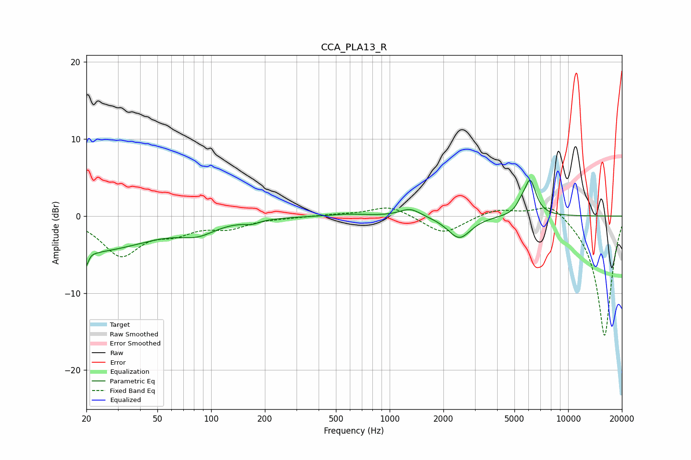

# CCA_PLA13_R
See [usage instructions](https://github.com/jaakkopasanen/AutoEq#usage) for more options and info.

### Parametric EQs
Apply preamp of -4.8 dB when using parametric equalizer.

|   # | Type    |   Fc (Hz) |    Q |   Gain (dB) |
|-----|---------|-----------|------|-------------|
|   1 | Peaking |        20 | 5.86 |        -5.1 |
|   2 | Peaking |        20 | 6    |         3.2 |
|   3 | Peaking |        22 | 0.45 |        -4.4 |
|   4 | Peaking |        84 | 1.41 |        -1.4 |
|   5 | Peaking |       169 | 3.23 |        -0.5 |
|   6 | Peaking |       579 | 1.49 |         0.3 |
|   7 | Peaking |      1304 | 2.4  |         1.1 |
|   8 | Peaking |      2456 | 2.19 |        -2.9 |
|   9 | Peaking |      5428 | 6    |         0.7 |
|  10 | Peaking |      6122 | 4.23 |         4.6 |

### Fixed Band EQs
When using fixed band (also called graphic) equalizer, apply preamp of **-1.2 dB** (if available) and set gains manually with these parameters.

|   # | Type    |   Fc (Hz) |    Q |   Gain (dB) |
|-----|---------|-----------|------|-------------|
|   1 | Peaking |        31 | 1.41 |        -4.9 |
|   2 | Peaking |        62 | 1.41 |        -1.7 |
|   3 | Peaking |       125 | 1.41 |        -1.3 |
|   4 | Peaking |       250 | 1.41 |        -0.1 |
|   5 | Peaking |       500 | 1.41 |         0.2 |
|   6 | Peaking |      1000 | 1.41 |         1.4 |
|   7 | Peaking |      2000 | 1.41 |        -2.4 |
|   8 | Peaking |      4000 | 1.41 |         1   |
|   9 | Peaking |      8000 | 1.41 |         2   |
|  10 | Peaking |     16000 | 1.41 |       -15.7 |

### Graphs

