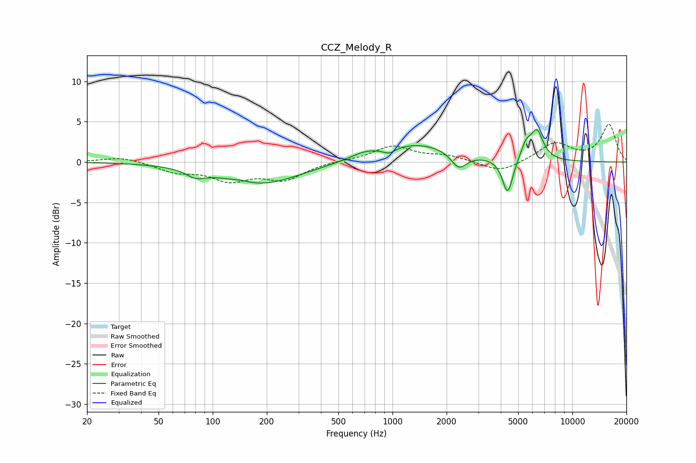

# CCZ_Melody_R
See [usage instructions](https://github.com/jaakkopasanen/AutoEq#usage) for more options and info.

### Parametric EQs
Apply preamp of -4.1 dB when using parametric equalizer.

|   # | Type    |   Fc (Hz) |    Q |   Gain (dB) |
|-----|---------|-----------|------|-------------|
|   1 | Peaking |        81 | 2.69 |        -0.9 |
|   2 | Peaking |       143 | 2.76 |         0.3 |
|   3 | Peaking |       183 | 0.64 |        -2.8 |
|   4 | Peaking |       697 | 1.77 |         0.7 |
|   5 | Peaking |       958 | 4.28 |        -0.7 |
|   6 | Peaking |      1389 | 0.68 |         2.3 |
|   7 | Peaking |      2343 | 3.24 |        -2   |
|   8 | Peaking |      4374 | 4.83 |        -4.5 |
|   9 | Peaking |      5533 | 4.72 |         1.8 |
|  10 | Peaking |      6364 | 3.9  |         3.5 |

### Fixed Band EQs
When using fixed band (also called graphic) equalizer, apply preamp of **-4.8 dB** (if available) and set gains manually with these parameters.

|   # | Type    |   Fc (Hz) |    Q |   Gain (dB) |
|-----|---------|-----------|------|-------------|
|   1 | Peaking |        31 | 1.41 |         0.7 |
|   2 | Peaking |        62 | 1.41 |        -1.1 |
|   3 | Peaking |       125 | 1.41 |        -2.1 |
|   4 | Peaking |       250 | 1.41 |        -2   |
|   5 | Peaking |       500 | 1.41 |         0.1 |
|   6 | Peaking |      1000 | 1.41 |         1.9 |
|   7 | Peaking |      2000 | 1.41 |         0.7 |
|   8 | Peaking |      4000 | 1.41 |        -1.4 |
|   9 | Peaking |      8000 | 1.41 |         2.3 |
|  10 | Peaking |     16000 | 1.41 |         4.6 |

### Graphs

