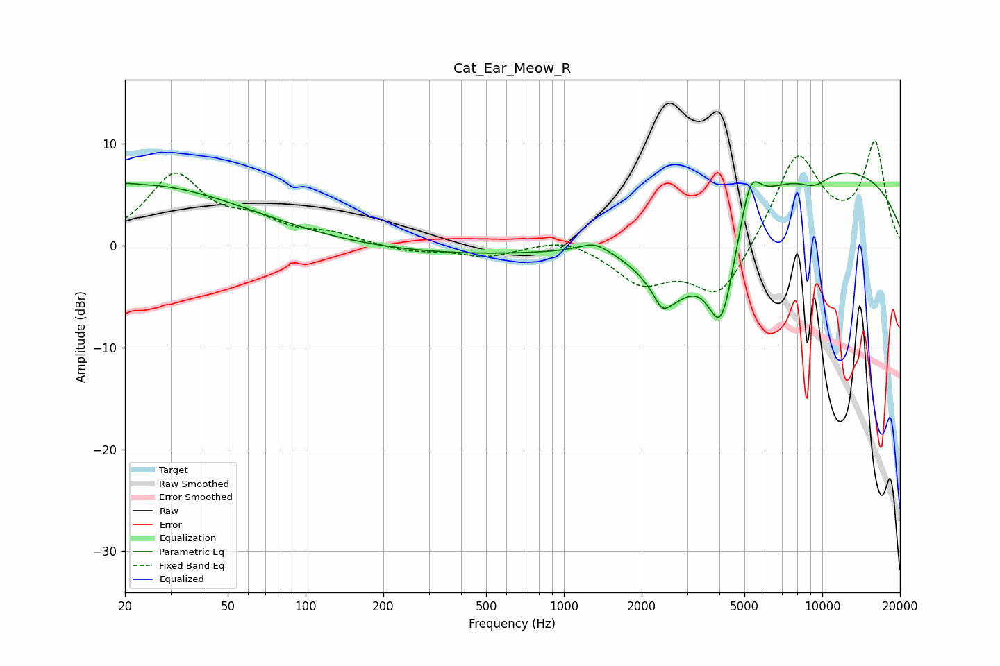

# Cat_Ear_Meow_R
See [usage instructions](https://github.com/jaakkopasanen/AutoEq#usage) for more options and info.

### Parametric EQs
Apply preamp of -7.2 dB when using parametric equalizer.

|   # | Type    |   Fc (Hz) |    Q |   Gain (dB) |
|-----|---------|-----------|------|-------------|
|   1 | Peaking |        20 | 5.7  |         0.2 |
|   2 | Peaking |        22 | 0.34 |         6   |
|   3 | Peaking |       529 | 0.29 |        -1   |
|   4 | Peaking |      1315 | 2.39 |         1   |
|   5 | Peaking |      2401 | 4.94 |        -1.4 |
|   6 | Peaking |      2585 | 1.23 |        -7   |
|   7 | Peaking |      4063 | 2.33 |       -10.6 |
|   8 | Peaking |      5262 | 3.5  |         4.5 |
|   9 | Peaking |      9339 | 2.06 |        -1.4 |
|  10 | Peaking |      9616 | 0.23 |         8   |

### Fixed Band EQs
When using fixed band (also called graphic) equalizer, apply preamp of **-10.4 dB** (if available) and set gains manually with these parameters.

|   # | Type    |   Fc (Hz) |    Q |   Gain (dB) |
|-----|---------|-----------|------|-------------|
|   1 | Peaking |        31 | 1.41 |         6.7 |
|   2 | Peaking |        62 | 1.41 |         2   |
|   3 | Peaking |       125 | 1.41 |         1   |
|   4 | Peaking |       250 | 1.41 |        -0.6 |
|   5 | Peaking |       500 | 1.41 |        -1.1 |
|   6 | Peaking |      1000 | 1.41 |         0.9 |
|   7 | Peaking |      2000 | 1.41 |        -3.5 |
|   8 | Peaking |      4000 | 1.41 |        -5.3 |
|   9 | Peaking |      8000 | 1.41 |         9   |
|  10 | Peaking |     16000 | 1.41 |         9.9 |

### Graphs

