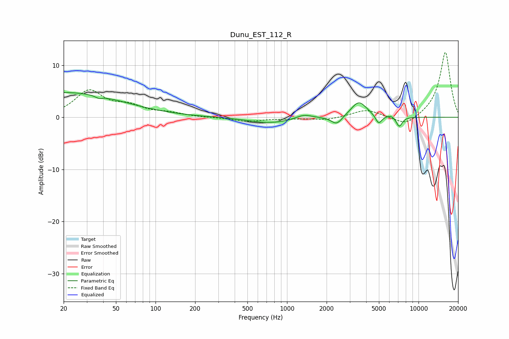

# Dunu_EST_112_R
See [usage instructions](https://github.com/jaakkopasanen/AutoEq#usage) for more options and info.

### Parametric EQs
Apply preamp of -4.9 dB when using parametric equalizer.

|   # | Type    |   Fc (Hz) |    Q |   Gain (dB) |
|-----|---------|-----------|------|-------------|
|   1 | Peaking |        20 | 0.31 |         4.8 |
|   2 | Peaking |        37 | 5.61 |        -0.5 |
|   3 | Peaking |       716 | 0.91 |        -1   |
|   4 | Peaking |       973 | 0.95 |        -0.2 |
|   5 | Peaking |      1342 | 2.21 |         0.9 |
|   6 | Peaking |      2391 | 3.36 |        -1.7 |
|   7 | Peaking |      3521 | 2.34 |         3.1 |
|   8 | Peaking |      4976 | 5.98 |        -1.7 |
|   9 | Peaking |      6186 | 5.09 |         0.4 |
|  10 | Peaking |      7137 | 6    |        -1.9 |

### Fixed Band EQs
When using fixed band (also called graphic) equalizer, apply preamp of **-12.5 dB** (if available) and set gains manually with these parameters.

|   # | Type    |   Fc (Hz) |    Q |   Gain (dB) |
|-----|---------|-----------|------|-------------|
|   1 | Peaking |        31 | 1.41 |         4.9 |
|   2 | Peaking |        62 | 1.41 |         1.8 |
|   3 | Peaking |       125 | 1.41 |         0.7 |
|   4 | Peaking |       250 | 1.41 |        -0.1 |
|   5 | Peaking |       500 | 1.41 |        -0.8 |
|   6 | Peaking |      1000 | 1.41 |        -0.2 |
|   7 | Peaking |      2000 | 1.41 |        -0.5 |
|   8 | Peaking |      4000 | 1.41 |         1.5 |
|   9 | Peaking |      8000 | 1.41 |        -1.8 |
|  10 | Peaking |     16000 | 1.41 |        12.6 |

### Graphs

