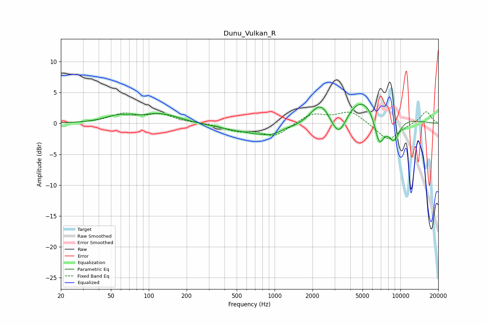

# Dunu_Vulkan_R
See [usage instructions](https://github.com/jaakkopasanen/AutoEq#usage) for more options and info.

### Parametric EQs
Apply preamp of -3.2 dB when using parametric equalizer.

|   # | Type    |   Fc (Hz) |    Q |   Gain (dB) |
|-----|---------|-----------|------|-------------|
|   1 | Peaking |        56 | 1.46 |         1   |
|   2 | Peaking |       123 | 0.92 |         1.6 |
|   3 | Peaking |       568 | 0.65 |        -0.9 |
|   4 | Peaking |      1087 | 0.95 |        -2.2 |
|   5 | Peaking |      1212 | 1.91 |         0.9 |
|   6 | Peaking |      2314 | 1.94 |         2.9 |
|   7 | Peaking |      3240 | 2.06 |        -5.1 |
|   8 | Peaking |      5026 | 0.68 |         5.4 |
|   9 | Peaking |      6792 | 3.09 |        -5.7 |
|  10 | Peaking |      8839 | 2.41 |        -4.2 |

### Fixed Band EQs
When using fixed band (also called graphic) equalizer, apply preamp of **-2.0 dB** (if available) and set gains manually with these parameters.

|   # | Type    |   Fc (Hz) |    Q |   Gain (dB) |
|-----|---------|-----------|------|-------------|
|   1 | Peaking |        31 | 1.41 |         0   |
|   2 | Peaking |        62 | 1.41 |         1.4 |
|   3 | Peaking |       125 | 1.41 |         1.3 |
|   4 | Peaking |       250 | 1.41 |         0.1 |
|   5 | Peaking |       500 | 1.41 |        -1.1 |
|   6 | Peaking |      1000 | 1.41 |        -2.1 |
|   7 | Peaking |      2000 | 1.41 |         1.6 |
|   8 | Peaking |      4000 | 1.41 |         2   |
|   9 | Peaking |      8000 | 1.41 |        -2.8 |
|  10 | Peaking |     16000 | 1.41 |         2   |

### Graphs

