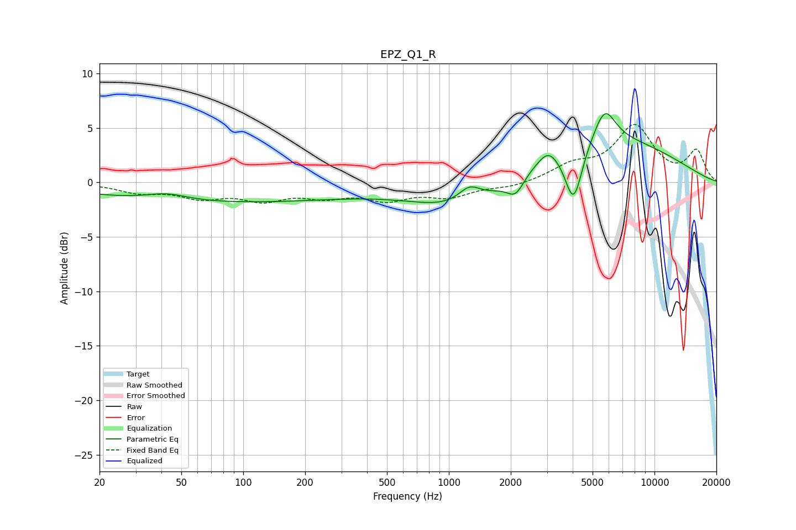

# EPZ_Q1_R
See [usage instructions](https://github.com/jaakkopasanen/AutoEq#usage) for more options and info.

### Parametric EQs
Apply preamp of -6.4 dB when using parametric equalizer.

|   # | Type    |   Fc (Hz) |    Q |   Gain (dB) |
|-----|---------|-----------|------|-------------|
|   1 | Peaking |        42 | 1.4  |         0.7 |
|   2 | Peaking |        63 | 0.21 |        -0.7 |
|   3 | Peaking |        85 | 0.21 |        -1.2 |
|   4 | Peaking |      1261 | 2.54 |         1.5 |
|   5 | Peaking |      1334 | 0.55 |        -4.1 |
|   6 | Peaking |      2110 | 3.31 |        -1.7 |
|   7 | Peaking |      3043 | 3.11 |         1.1 |
|   8 | Peaking |      4043 | 3.27 |        -5.4 |
|   9 | Peaking |      4348 | 0.3  |         4.7 |
|  10 | Peaking |      5728 | 2.62 |         3.1 |

### Fixed Band EQs
When using fixed band (also called graphic) equalizer, apply preamp of **-5.4 dB** (if available) and set gains manually with these parameters.

|   # | Type    |   Fc (Hz) |    Q |   Gain (dB) |
|-----|---------|-----------|------|-------------|
|   1 | Peaking |        31 | 1.41 |        -0.8 |
|   2 | Peaking |        62 | 1.41 |        -1.2 |
|   3 | Peaking |       125 | 1.41 |        -1.4 |
|   4 | Peaking |       250 | 1.41 |        -1.1 |
|   5 | Peaking |       500 | 1.41 |        -1.4 |
|   6 | Peaking |      1000 | 1.41 |        -1.2 |
|   7 | Peaking |      2000 | 1.41 |        -0.4 |
|   8 | Peaking |      4000 | 1.41 |         1.4 |
|   9 | Peaking |      8000 | 1.41 |         5   |
|  10 | Peaking |     16000 | 1.41 |         2.8 |

### Graphs

