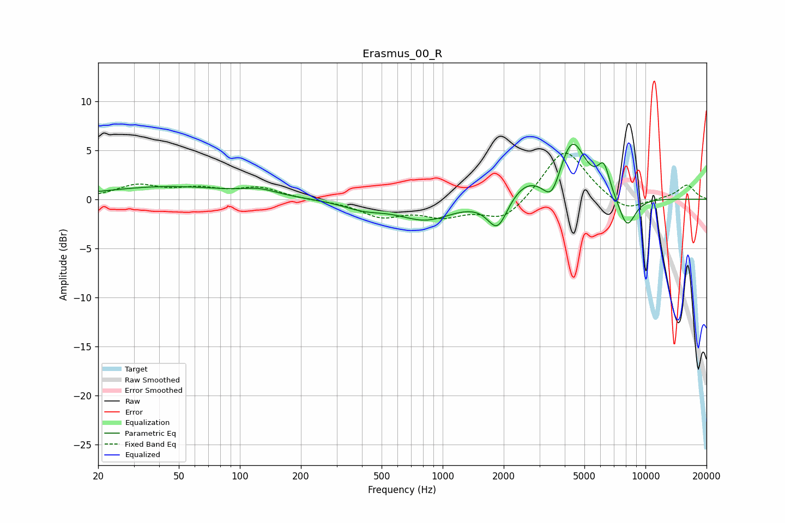

# Erasmus_00_R
See [usage instructions](https://github.com/jaakkopasanen/AutoEq#usage) for more options and info.

### Parametric EQs
Apply preamp of -5.7 dB when using parametric equalizer.

|   # | Type    |   Fc (Hz) |    Q |   Gain (dB) |
|-----|---------|-----------|------|-------------|
|   1 | Peaking |        44 | 0.44 |         1.3 |
|   2 | Peaking |       125 | 1.7  |         0.6 |
|   3 | Peaking |       406 | 1.36 |        -0.8 |
|   4 | Peaking |       827 | 1.04 |        -2   |
|   5 | Peaking |      1867 | 2.8  |        -3.4 |
|   6 | Peaking |      2558 | 1.47 |         1.8 |
|   7 | Peaking |      3454 | 3.29 |        -2.7 |
|   8 | Peaking |      4344 | 2.08 |         6   |
|   9 | Peaking |      6233 | 4.63 |         2.8 |
|  10 | Peaking |      8110 | 3.09 |        -3.3 |

### Fixed Band EQs
When using fixed band (also called graphic) equalizer, apply preamp of **-4.8 dB** (if available) and set gains manually with these parameters.

|   # | Type    |   Fc (Hz) |    Q |   Gain (dB) |
|-----|---------|-----------|------|-------------|
|   1 | Peaking |        31 | 1.41 |         1.3 |
|   2 | Peaking |        62 | 1.41 |         0.9 |
|   3 | Peaking |       125 | 1.41 |         1.1 |
|   4 | Peaking |       250 | 1.41 |        -0.1 |
|   5 | Peaking |       500 | 1.41 |        -1.6 |
|   6 | Peaking |      1000 | 1.41 |        -1.5 |
|   7 | Peaking |      2000 | 1.41 |        -2.2 |
|   8 | Peaking |      4000 | 1.41 |         5.3 |
|   9 | Peaking |      8000 | 1.41 |        -1.4 |
|  10 | Peaking |     16000 | 1.41 |         1.5 |

### Graphs

