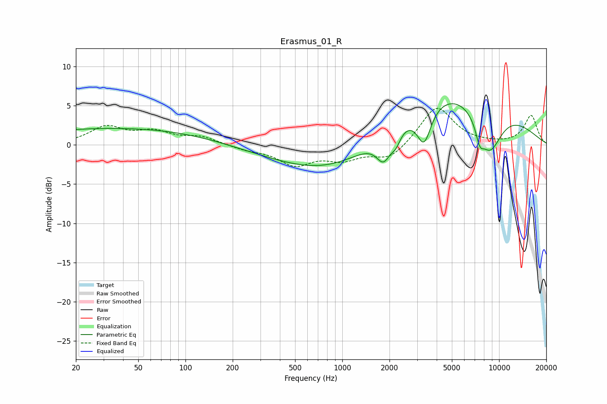

# Erasmus_01_R
See [usage instructions](https://github.com/jaakkopasanen/AutoEq#usage) for more options and info.

### Parametric EQs
Apply preamp of -5.4 dB when using parametric equalizer.

|   # | Type    |   Fc (Hz) |    Q |   Gain (dB) |
|-----|---------|-----------|------|-------------|
|   1 | Peaking |        39 | 0.22 |         2.2 |
|   2 | Peaking |        40 | 1.7  |        -0   |
|   3 | Peaking |       552 | 0.28 |        -0.9 |
|   4 | Peaking |       937 | 0.42 |        -3.2 |
|   5 | Peaking |      1837 | 3.03 |        -3.2 |
|   6 | Peaking |      2198 | 4.65 |        -1.4 |
|   7 | Peaking |      3324 | 3.1  |        -4.7 |
|   8 | Peaking |      5174 | 0.32 |         7.9 |
|   9 | Peaking |      7522 | 5.31 |        -2   |
|  10 | Peaking |      8680 | 1.53 |        -6.6 |

### Fixed Band EQs
When using fixed band (also called graphic) equalizer, apply preamp of **-4.8 dB** (if available) and set gains manually with these parameters.

|   # | Type    |   Fc (Hz) |    Q |   Gain (dB) |
|-----|---------|-----------|------|-------------|
|   1 | Peaking |        31 | 1.41 |         2.2 |
|   2 | Peaking |        62 | 1.41 |         1.5 |
|   3 | Peaking |       125 | 1.41 |         1   |
|   4 | Peaking |       250 | 1.41 |        -0.5 |
|   5 | Peaking |       500 | 1.41 |        -2.4 |
|   6 | Peaking |      1000 | 1.41 |        -1.6 |
|   7 | Peaking |      2000 | 1.41 |        -1.9 |
|   8 | Peaking |      4000 | 1.41 |         5   |
|   9 | Peaking |      8000 | 1.41 |         0.1 |
|  10 | Peaking |     16000 | 1.41 |         3.7 |

### Graphs

