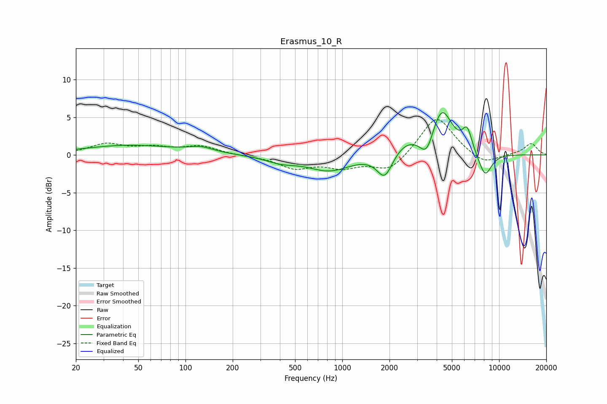

# Erasmus_10_R
See [usage instructions](https://github.com/jaakkopasanen/AutoEq#usage) for more options and info.

### Parametric EQs
Apply preamp of -5.7 dB when using parametric equalizer.

|   # | Type    |   Fc (Hz) |    Q |   Gain (dB) |
|-----|---------|-----------|------|-------------|
|   1 | Peaking |        44 | 0.48 |         1.3 |
|   2 | Peaking |       125 | 1.8  |         0.7 |
|   3 | Peaking |       407 | 1.42 |        -0.8 |
|   4 | Peaking |       827 | 1.04 |        -2   |
|   5 | Peaking |      1866 | 2.81 |        -3.4 |
|   6 | Peaking |      2578 | 1.4  |         1.7 |
|   7 | Peaking |      3458 | 3.28 |        -2.8 |
|   8 | Peaking |      4303 | 2.08 |         6   |
|   9 | Peaking |      6259 | 4.44 |         2.8 |
|  10 | Peaking |      8132 | 3.05 |        -3.2 |

### Fixed Band EQs
When using fixed band (also called graphic) equalizer, apply preamp of **-4.8 dB** (if available) and set gains manually with these parameters.

|   # | Type    |   Fc (Hz) |    Q |   Gain (dB) |
|-----|---------|-----------|------|-------------|
|   1 | Peaking |        31 | 1.41 |         1.4 |
|   2 | Peaking |        62 | 1.41 |         0.8 |
|   3 | Peaking |       125 | 1.41 |         1.1 |
|   4 | Peaking |       250 | 1.41 |        -0.1 |
|   5 | Peaking |       500 | 1.41 |        -1.6 |
|   6 | Peaking |      1000 | 1.41 |        -1.4 |
|   7 | Peaking |      2000 | 1.41 |        -2.2 |
|   8 | Peaking |      4000 | 1.41 |         5.3 |
|   9 | Peaking |      8000 | 1.41 |        -1.4 |
|  10 | Peaking |     16000 | 1.41 |         1.5 |

### Graphs

