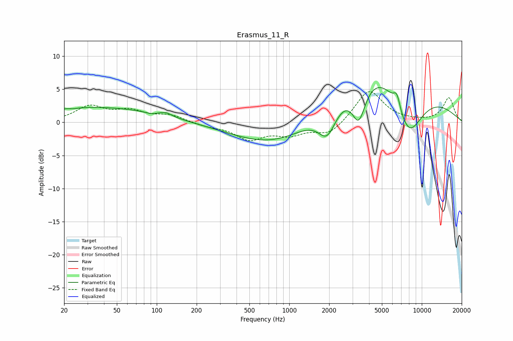

# Erasmus_11_R
See [usage instructions](https://github.com/jaakkopasanen/AutoEq#usage) for more options and info.

### Parametric EQs
Apply preamp of -5.4 dB when using parametric equalizer.

|   # | Type    |   Fc (Hz) |    Q |   Gain (dB) |
|-----|---------|-----------|------|-------------|
|   1 | Peaking |        24 | 5.82 |        -0.1 |
|   2 | Peaking |        34 | 0.29 |         2.3 |
|   3 | Peaking |        91 | 3.84 |        -0.2 |
|   4 | Peaking |       116 | 3.02 |         0.6 |
|   5 | Peaking |       835 | 0.44 |        -3.9 |
|   6 | Peaking |      1934 | 2.05 |        -4.5 |
|   7 | Peaking |      3346 | 2.77 |        -5.5 |
|   8 | Peaking |      5508 | 0.36 |        11.5 |
|   9 | Peaking |      6482 | 5.52 |         2.1 |
|  10 | Peaking |      7906 | 1.01 |       -10.7 |

### Fixed Band EQs
When using fixed band (also called graphic) equalizer, apply preamp of **-4.7 dB** (if available) and set gains manually with these parameters.

|   # | Type    |   Fc (Hz) |    Q |   Gain (dB) |
|-----|---------|-----------|------|-------------|
|   1 | Peaking |        31 | 1.41 |         2.3 |
|   2 | Peaking |        62 | 1.41 |         1.5 |
|   3 | Peaking |       125 | 1.41 |         1   |
|   4 | Peaking |       250 | 1.41 |        -0.5 |
|   5 | Peaking |       500 | 1.41 |        -2.4 |
|   6 | Peaking |      1000 | 1.41 |        -1.6 |
|   7 | Peaking |      2000 | 1.41 |        -1.9 |
|   8 | Peaking |      4000 | 1.41 |         5   |
|   9 | Peaking |      8000 | 1.41 |         0.1 |
|  10 | Peaking |     16000 | 1.41 |         3.7 |

### Graphs

