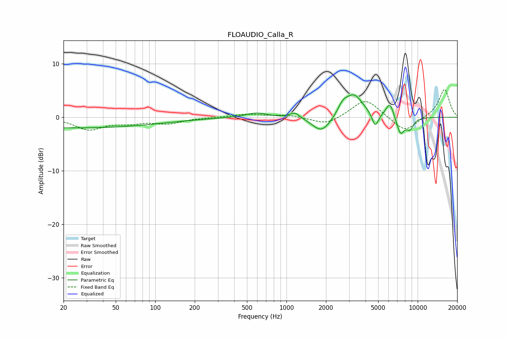

# FLOAUDIO_Calla_R
See [usage instructions](https://github.com/jaakkopasanen/AutoEq#usage) for more options and info.

### Parametric EQs
Apply preamp of -4.3 dB when using parametric equalizer.

|   # | Type    |   Fc (Hz) |    Q |   Gain (dB) |
|-----|---------|-----------|------|-------------|
|   1 | Peaking |        23 | 0.18 |        -2   |
|   2 | Peaking |       591 | 1.76 |         0.9 |
|   3 | Peaking |      1159 | 3.75 |         1.1 |
|   4 | Peaking |      1858 | 2    |        -3.1 |
|   5 | Peaking |      2683 | 4.21 |         1.4 |
|   6 | Peaking |      3247 | 1.94 |         4.4 |
|   7 | Peaking |      4746 | 5.69 |        -2.7 |
|   8 | Peaking |      6138 | 4.58 |         2.8 |
|   9 | Peaking |      7397 | 4.36 |        -3.3 |
|  10 | Peaking |      8730 | 4.56 |        -2   |

### Fixed Band EQs
When using fixed band (also called graphic) equalizer, apply preamp of **-5.3 dB** (if available) and set gains manually with these parameters.

|   # | Type    |   Fc (Hz) |    Q |   Gain (dB) |
|-----|---------|-----------|------|-------------|
|   1 | Peaking |        31 | 1.41 |        -2.2 |
|   2 | Peaking |        62 | 1.41 |        -0.9 |
|   3 | Peaking |       125 | 1.41 |        -1.1 |
|   4 | Peaking |       250 | 1.41 |        -0   |
|   5 | Peaking |       500 | 1.41 |         0.6 |
|   6 | Peaking |      1000 | 1.41 |         0.4 |
|   7 | Peaking |      2000 | 1.41 |        -1.5 |
|   8 | Peaking |      4000 | 1.41 |         3.5 |
|   9 | Peaking |      8000 | 1.41 |        -2.9 |
|  10 | Peaking |     16000 | 1.41 |         5.3 |

### Graphs

