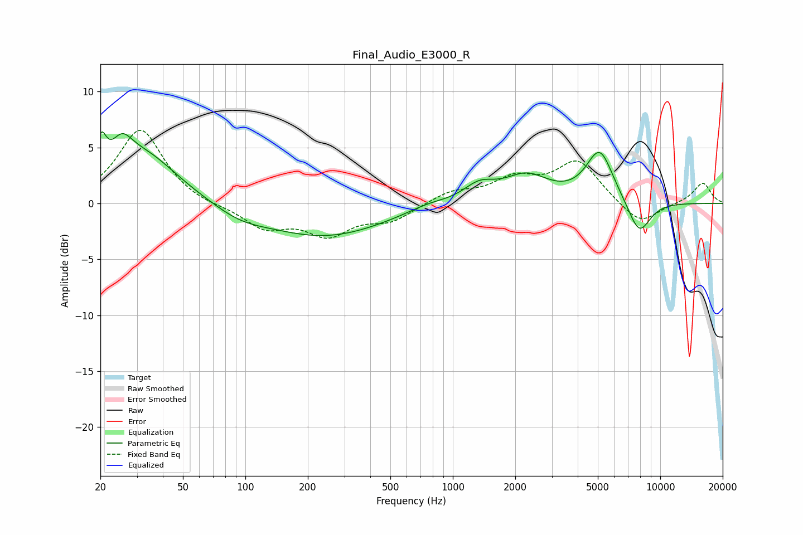

# Final_Audio_E3000_R
See [usage instructions](https://github.com/jaakkopasanen/AutoEq#usage) for more options and info.

### Parametric EQs
Apply preamp of -6.5 dB when using parametric equalizer.

|   # | Type    |   Fc (Hz) |    Q |   Gain (dB) |
|-----|---------|-----------|------|-------------|
|   1 | Peaking |        20 | 5.96 |         2.9 |
|   2 | Peaking |        25 | 2.94 |         2.2 |
|   3 | Peaking |        32 | 0.83 |         4.5 |
|   4 | Peaking |        94 | 1.11 |        -0.9 |
|   5 | Peaking |       241 | 0.48 |        -2.9 |
|   6 | Peaking |       758 | 1.39 |         0.5 |
|   7 | Peaking |      1339 | 1.85 |         1.5 |
|   8 | Peaking |      2264 | 1.29 |         2.3 |
|   9 | Peaking |      5106 | 2.12 |         4.6 |
|  10 | Peaking |      7906 | 2.39 |        -3.1 |

### Fixed Band EQs
When using fixed band (also called graphic) equalizer, apply preamp of **-6.6 dB** (if available) and set gains manually with these parameters.

|   # | Type    |   Fc (Hz) |    Q |   Gain (dB) |
|-----|---------|-----------|------|-------------|
|   1 | Peaking |        31 | 1.41 |         6.7 |
|   2 | Peaking |        62 | 1.41 |        -0.3 |
|   3 | Peaking |       125 | 1.41 |        -2.1 |
|   4 | Peaking |       250 | 1.41 |        -2.6 |
|   5 | Peaking |       500 | 1.41 |        -1.4 |
|   6 | Peaking |      1000 | 1.41 |         1   |
|   7 | Peaking |      2000 | 1.41 |         2   |
|   8 | Peaking |      4000 | 1.41 |         3.7 |
|   9 | Peaking |      8000 | 1.41 |        -2   |
|  10 | Peaking |     16000 | 1.41 |         1.9 |

### Graphs

