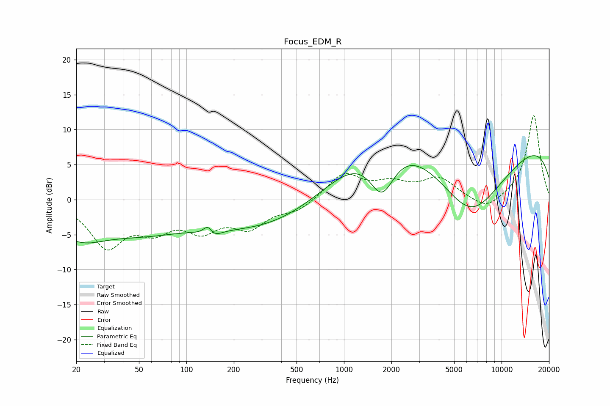

# Focus_EDM_R
See [usage instructions](https://github.com/jaakkopasanen/AutoEq#usage) for more options and info.

### Parametric EQs
Apply preamp of -6.4 dB when using parametric equalizer.

|   # | Type    |   Fc (Hz) |    Q |   Gain (dB) |
|-----|---------|-----------|------|-------------|
|   1 | Peaking |        20 | 0.89 |        -4.2 |
|   2 | Peaking |        20 | 2.45 |         0.3 |
|   3 | Peaking |        52 | 0.46 |        -3.9 |
|   4 | Peaking |       138 | 4.05 |         4   |
|   5 | Peaking |       141 | 3.16 |        -3.7 |
|   6 | Peaking |       330 | 0.38 |        -4.1 |
|   7 | Peaking |      1743 | 1.54 |        -8.3 |
|   8 | Peaking |      1760 | 0.5  |         8.7 |
|   9 | Peaking |      6346 | 0.51 |       -13.7 |
|  10 | Peaking |      9199 | 0.18 |        11.3 |

### Fixed Band EQs
When using fixed band (also called graphic) equalizer, apply preamp of **-12.1 dB** (if available) and set gains manually with these parameters.

|   # | Type    |   Fc (Hz) |    Q |   Gain (dB) |
|-----|---------|-----------|------|-------------|
|   1 | Peaking |        31 | 1.41 |        -6.4 |
|   2 | Peaking |        62 | 1.41 |        -3.5 |
|   3 | Peaking |       125 | 1.41 |        -3.7 |
|   4 | Peaking |       250 | 1.41 |        -3.5 |
|   5 | Peaking |       500 | 1.41 |        -1.5 |
|   6 | Peaking |      1000 | 1.41 |         3.7 |
|   7 | Peaking |      2000 | 1.41 |         1.9 |
|   8 | Peaking |      4000 | 1.41 |         2.9 |
|   9 | Peaking |      8000 | 1.41 |        -1.8 |
|  10 | Peaking |     16000 | 1.41 |        12.1 |

### Graphs

