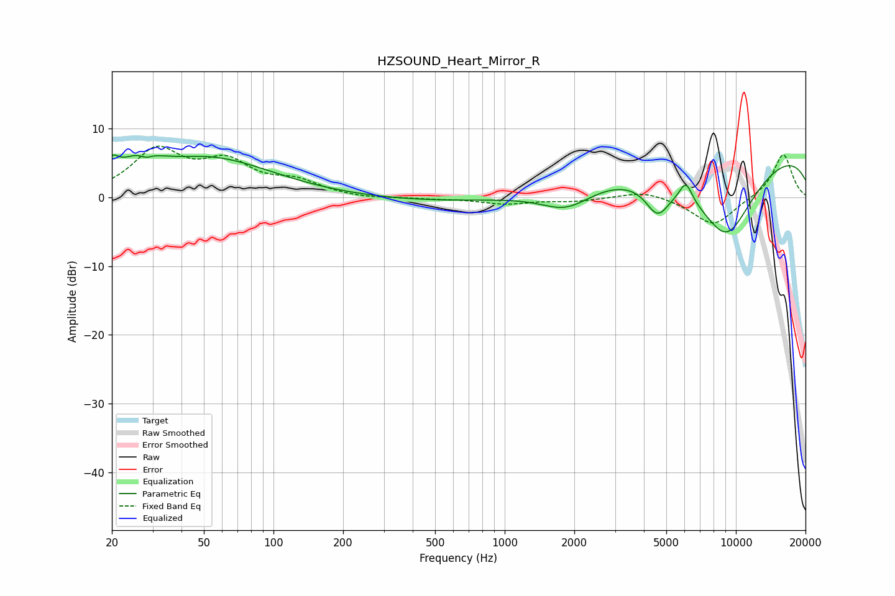

# HZSOUND_Heart_Mirror_R
See [usage instructions](https://github.com/jaakkopasanen/AutoEq#usage) for more options and info.

### Parametric EQs
Apply preamp of -6.3 dB when using parametric equalizer.

|   # | Type    |   Fc (Hz) |    Q |   Gain (dB) |
|-----|---------|-----------|------|-------------|
|   1 | Peaking |        20 | 5.19 |         2.2 |
|   2 | Peaking |        26 | 1.66 |         2.9 |
|   3 | Peaking |        28 | 5.55 |        -0.7 |
|   4 | Peaking |        53 | 0.52 |         5.6 |
|   5 | Peaking |      1372 | 0.18 |        -0.9 |
|   6 | Peaking |      1850 | 1.27 |        -3.2 |
|   7 | Peaking |      4580 | 2.68 |        -4.5 |
|   8 | Peaking |      6078 | 4.95 |         2.9 |
|   9 | Peaking |      9081 | 0.9  |       -12.6 |
|  10 | Peaking |      9956 | 0.18 |         8.1 |

### Fixed Band EQs
When using fixed band (also called graphic) equalizer, apply preamp of **-7.6 dB** (if available) and set gains manually with these parameters.

|   # | Type    |   Fc (Hz) |    Q |   Gain (dB) |
|-----|---------|-----------|------|-------------|
|   1 | Peaking |        31 | 1.41 |         6.5 |
|   2 | Peaking |        62 | 1.41 |         4.5 |
|   3 | Peaking |       125 | 1.41 |         2   |
|   4 | Peaking |       250 | 1.41 |        -0.3 |
|   5 | Peaking |       500 | 1.41 |        -0.2 |
|   6 | Peaking |      1000 | 1.41 |        -0.9 |
|   7 | Peaking |      2000 | 1.41 |        -0.5 |
|   8 | Peaking |      4000 | 1.41 |         1.1 |
|   9 | Peaking |      8000 | 1.41 |        -4.2 |
|  10 | Peaking |     16000 | 1.41 |         6.4 |

### Graphs

