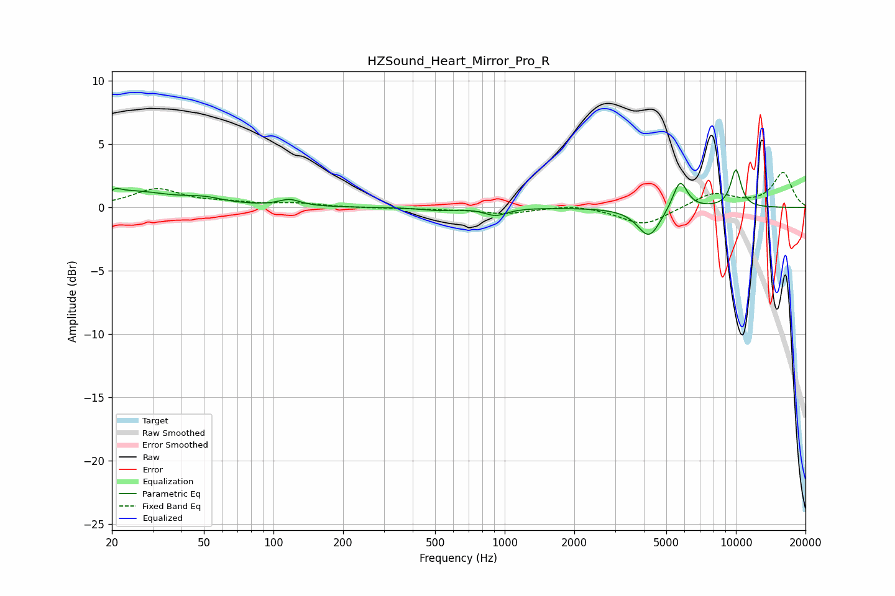

# HZSound_Heart_Mirror_Pro_R
See [usage instructions](https://github.com/jaakkopasanen/AutoEq#usage) for more options and info.

### Parametric EQs
Apply preamp of -3.1 dB when using parametric equalizer.

|   # | Type    |   Fc (Hz) |    Q |   Gain (dB) |
|-----|---------|-----------|------|-------------|
|   1 | Peaking |        20 | 5.96 |        -1.1 |
|   2 | Peaking |        20 | 5.99 |         1.3 |
|   3 | Peaking |        24 | 0.83 |         1.2 |
|   4 | Peaking |        50 | 1.65 |         0.4 |
|   5 | Peaking |       117 | 3.07 |         0.5 |
|   6 | Peaking |       515 | 2.12 |        -0.2 |
|   7 | Peaking |       913 | 2.98 |        -0.6 |
|   8 | Peaking |      4211 | 2.81 |        -2.4 |
|   9 | Peaking |      5731 | 4.4  |         2.4 |
|  10 | Peaking |     10000 | 5.28 |         3   |

### Fixed Band EQs
When using fixed band (also called graphic) equalizer, apply preamp of **-2.9 dB** (if available) and set gains manually with these parameters.

|   # | Type    |   Fc (Hz) |    Q |   Gain (dB) |
|-----|---------|-----------|------|-------------|
|   1 | Peaking |        31 | 1.41 |         1.4 |
|   2 | Peaking |        62 | 1.41 |         0.3 |
|   3 | Peaking |       125 | 1.41 |         0.3 |
|   4 | Peaking |       250 | 1.41 |        -0   |
|   5 | Peaking |       500 | 1.41 |        -0.1 |
|   6 | Peaking |      1000 | 1.41 |        -0.5 |
|   7 | Peaking |      2000 | 1.41 |         0.3 |
|   8 | Peaking |      4000 | 1.41 |        -1.4 |
|   9 | Peaking |      8000 | 1.41 |         1.2 |
|  10 | Peaking |     16000 | 1.41 |         2.7 |

### Graphs

