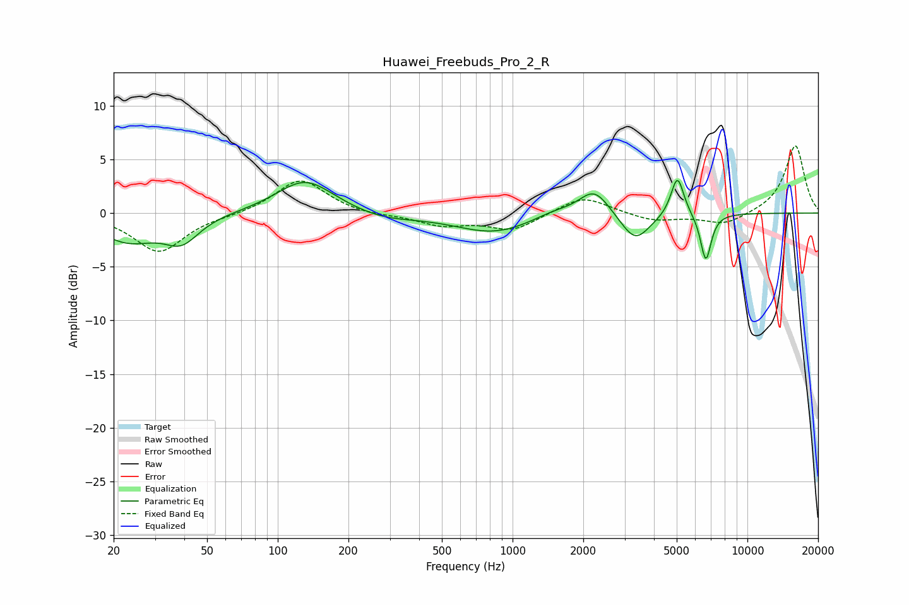

# Huawei_Freebuds_Pro_2_R
See [usage instructions](https://github.com/jaakkopasanen/AutoEq#usage) for more options and info.

### Parametric EQs
Apply preamp of -3.2 dB when using parametric equalizer.

|   # | Type    |   Fc (Hz) |    Q |   Gain (dB) |
|-----|---------|-----------|------|-------------|
|   1 | Peaking |        23 | 1.13 |        -2.5 |
|   2 | Peaking |        39 | 1.94 |        -2.3 |
|   3 | Peaking |       131 | 1.17 |         3.2 |
|   4 | Peaking |       283 | 1.06 |        -0.6 |
|   5 | Peaking |       834 | 0.85 |        -1.8 |
|   6 | Peaking |      1486 | 1.65 |         0.6 |
|   7 | Peaking |      2228 | 2.16 |         2.5 |
|   8 | Peaking |      3330 | 2.26 |        -2.7 |
|   9 | Peaking |      5033 | 5.06 |         3.8 |
|  10 | Peaking |      6652 | 6    |        -4.5 |

### Fixed Band EQs
When using fixed band (also called graphic) equalizer, apply preamp of **-6.3 dB** (if available) and set gains manually with these parameters.

|   # | Type    |   Fc (Hz) |    Q |   Gain (dB) |
|-----|---------|-----------|------|-------------|
|   1 | Peaking |        31 | 1.41 |        -3.6 |
|   2 | Peaking |        62 | 1.41 |        -0.2 |
|   3 | Peaking |       125 | 1.41 |         3.2 |
|   4 | Peaking |       250 | 1.41 |        -0.3 |
|   5 | Peaking |       500 | 1.41 |        -1.1 |
|   6 | Peaking |      1000 | 1.41 |        -1.6 |
|   7 | Peaking |      2000 | 1.41 |         1.7 |
|   8 | Peaking |      4000 | 1.41 |        -0.8 |
|   9 | Peaking |      8000 | 1.41 |        -1.1 |
|  10 | Peaking |     16000 | 1.41 |         6.3 |

### Graphs

