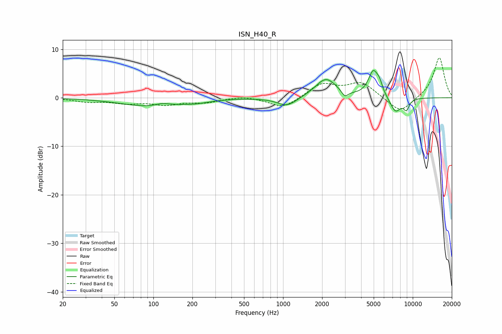

# ISN_H40_R
See [usage instructions](https://github.com/jaakkopasanen/AutoEq#usage) for more options and info.

### Parametric EQs
Apply preamp of -5.7 dB when using parametric equalizer.

|   # | Type    |   Fc (Hz) |    Q |   Gain (dB) |
|-----|---------|-----------|------|-------------|
|   1 | Peaking |        93 | 0.62 |        -1.7 |
|   2 | Peaking |       117 | 2.69 |         0.6 |
|   3 | Peaking |       212 | 1.33 |        -0.6 |
|   4 | Peaking |      1076 | 1.87 |        -1.9 |
|   5 | Peaking |      2140 | 1.74 |         4   |
|   6 | Peaking |      2993 | 5.57 |        -1.3 |
|   7 | Peaking |      4958 | 3.6  |         5.2 |
|   8 | Peaking |      5547 | 5.9  |         1.7 |
|   9 | Peaking |      7360 | 3.18 |        -3.1 |
|  10 | Peaking |      8931 | 5.71 |        -2   |

### Fixed Band EQs
When using fixed band (also called graphic) equalizer, apply preamp of **-8.3 dB** (if available) and set gains manually with these parameters.

|   # | Type    |   Fc (Hz) |    Q |   Gain (dB) |
|-----|---------|-----------|------|-------------|
|   1 | Peaking |        31 | 1.41 |        -0.7 |
|   2 | Peaking |        62 | 1.41 |        -1   |
|   3 | Peaking |       125 | 1.41 |        -1.3 |
|   4 | Peaking |       250 | 1.41 |        -0.9 |
|   5 | Peaking |       500 | 1.41 |         0.4 |
|   6 | Peaking |      1000 | 1.41 |        -2.2 |
|   7 | Peaking |      2000 | 1.41 |         2.8 |
|   8 | Peaking |      4000 | 1.41 |         3.1 |
|   9 | Peaking |      8000 | 1.41 |        -3.3 |
|  10 | Peaking |     16000 | 1.41 |         8.4 |

### Graphs

