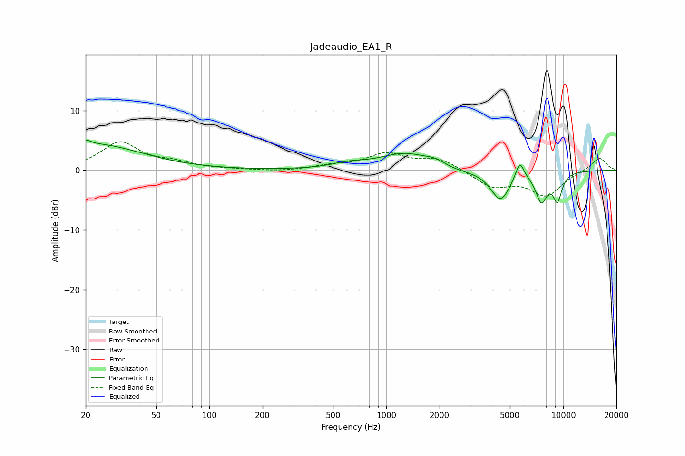

# Jadeaudio_EA1_R
See [usage instructions](https://github.com/jaakkopasanen/AutoEq#usage) for more options and info.

### Parametric EQs
Apply preamp of -5.2 dB when using parametric equalizer.

|   # | Type    |   Fc (Hz) |    Q |   Gain (dB) |
|-----|---------|-----------|------|-------------|
|   1 | Peaking |        20 | 5.31 |         0.9 |
|   2 | Peaking |        23 | 0.54 |         4.3 |
|   3 | Peaking |       615 | 1.47 |         0.8 |
|   4 | Peaking |      1279 | 0.98 |         2.7 |
|   5 | Peaking |      1900 | 2.45 |         0.9 |
|   6 | Peaking |      2410 | 1.26 |        -0.5 |
|   7 | Peaking |      4415 | 2.55 |        -5   |
|   8 | Peaking |      5682 | 5.57 |         3.1 |
|   9 | Peaking |      7534 | 4.07 |        -4.8 |
|  10 | Peaking |      9276 | 4.98 |        -4.5 |

### Fixed Band EQs
When using fixed band (also called graphic) equalizer, apply preamp of **-4.9 dB** (if available) and set gains manually with these parameters.

|   # | Type    |   Fc (Hz) |    Q |   Gain (dB) |
|-----|---------|-----------|------|-------------|
|   1 | Peaking |        31 | 1.41 |         4.6 |
|   2 | Peaking |        62 | 1.41 |         1   |
|   3 | Peaking |       125 | 1.41 |         0.1 |
|   4 | Peaking |       250 | 1.41 |        -0.2 |
|   5 | Peaking |       500 | 1.41 |         0.7 |
|   6 | Peaking |      1000 | 1.41 |         2.6 |
|   7 | Peaking |      2000 | 1.41 |         1.9 |
|   8 | Peaking |      4000 | 1.41 |        -2.7 |
|   9 | Peaking |      8000 | 1.41 |        -4.1 |
|  10 | Peaking |     16000 | 1.41 |         2.2 |

### Graphs

